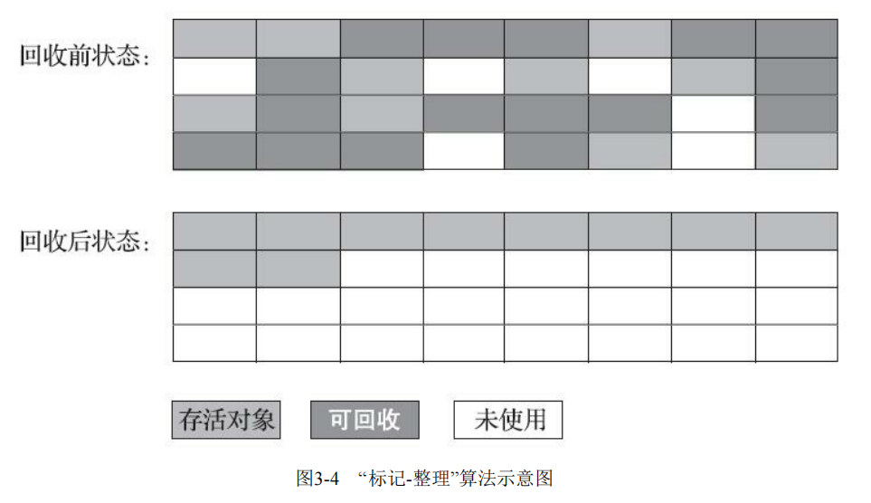
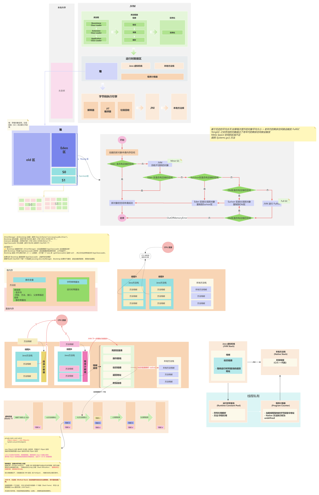

## JVM 当中是如何判断一个对象是垃圾

首先要想进行垃圾回收，前提是知道该对象是否是一个垃圾对象，因此在 JVM 当中有两种判断对象是否已死的策略，**引用计数法** 与 **可达性分析/根搜索算法** ，对于引用计数法而言，其本身是存在对象相互引用而无法被判断为垃圾对象的问题，如果大量的出现相互持有的对象，最终会导致内存泄漏，内存溢出的风险，因此该策略是不推荐使用的，在 JVM 当中默认是使用的另一种策略，**可达性分析算法** 。

**引用计数法**

引用计数法的原理很简单，就是每一个对象都有一个独属于自己的引用计数器，每当有一个地方引用了该对象，则该计数器就会 +1 ，而当引用失效则该计数器就会 -1 ，因此在任何时候当该对象的计数器 **为 0 则就表示该对象就是不可能在被使用了**，这里用代码解释一下这句话。

~~~ java
public static void main(String[] args) {
    Object A = new Object(); //这里创建了一个对象引用 A 指向了新创建的这个对象,因此这个对象的引用计数器 +1  = 1
    System.out.println("A="+A);
    Object B = A; //此时这里的引用 B 又指向了 A 的引用，而 A 又是引用了之前创建的对象计数器 +1  = 2
    System.out.println("B="+B);
    A = null; // A 取消了引用 -1 = 1
    B = null; // B 取消了引用 -1 = 0
    Object C = A; //此时 之间创建的 Object 对象无法再被引用,这里的 C = null
    System.out.println("C="+C);
}
~~~

> A=java.lang.Object@75828a0f
> B=java.lang.Object@75828a0f
> C=null

虽然客观的说，引用计数算法虽然占用了一些额外的内存空间来进行计数，但其因判断效率高，在绝大多数情况下其属于一个优秀的不错算法，但对于引入计数而言其存在一个较大的缺陷，比如对于 ObjA 与 ObjC 对象如果两个对象存在相互引用，即便实例在置为空的情况下，对象也无法通过引用计数将对象回收。

 

由于引用计数法存在这样的缺陷，所以 JVM 当中关于对象的是否死亡的判断使用了另一种策略，**可达性分析算法**

**可达性分析**

可达性分析的基本思路是通过一系列称为 **GC Roots** 的根对象作为起始节点，从这些节点开始，根据引用关系向下搜索，搜索过程所走过的路径称为 **引用链** ，而这条链路上的对象都是目前的存活对象，如果某个对象到 **GC Root** 间没有任何引用链相连，或者说从 **CG Root** 到这个对象不可达，则此对象是不可您再被使用的。

- 哪些对象作为 **GC Root** 
  1. 虚拟机栈（栈帧中的本地变量表）中引用的对象，譬如各个线程被调用的方法栈中使用到的参数、局部变量、临时变量等
  2. 方法区中类静态属性引用的对象，比如 Java 类的引用类型静态变量
  3. 方法区中常量引用的对象，比如字符串常量池里的引用
  4. 本地方法栈中 JNI 引用的对象
  5. Java 虚拟机内部引用，如基本数据类对于的 Class 对象
  6. 被同步锁（synchronization 关键字）持有的对象

**JDK1，2 版本之后的引用**

JDK 当中对引用的概念进行了细分，分为 强引用（Strongly Re-ference）、软引用（Soft Reference）、弱引用（Weak Reference）和虚引用（Phantom Reference），这 4 中引用强度依次减弱。

- 强引用 

  强引用就是传统意义上的引用，在代码当中普遍存在的一种引用赋值，既类似 “Object obj = new Object()” 这种引用关系，无论任何的情况下，只要强引用关系还在，垃圾收集器就永远不会回收掉被引用的对象。

~~~ java
Object obj = new Object();  // 强引用
obj = null;  // 取消强引用，对象可以被 GC 回收
~~~

- 软引用

  用来描述一些还有，但非必须的对象。只被软引用关联的对象，在系统将要发生内存溢出前，会把这些对象列进回收范围之中进行第二次回收，如果这次回收还没有足够的内存，才会抛出内存的溢出异常，适用于 **缓存** 场景，比如缓存图片、数据等，避免内存溢出。

~~~ java
SoftReference<Object> softRef = new SoftReference<>(new Object());
Object obj = softRef.get();  // 获取对象（可能为 null，如果被回收）
System.out.println(obj);      // 输出对象，如果内存不足可能返回 null
~~~

- 弱引用

  弱引用也是用来描述哪些非必须的对象，但是其强度比软引用更弱一些，被弱引用关联的对象只能能生存到下一次垃圾收集发生为止。当垃圾手机器开始工作，无论内存是否足够，都会回收掉只被弱引用关联的对象。

~~~ java
WeakReference<Object> weakRef = new WeakReference<>(new Object());
System.out.println(weakRef.get());  // 可能返回对象
System.gc();  // 触发 GC
System.out.println(weakRef.get());  // 很可能返回 null
~~~

- 虚引用

  虚引用被称为“幽灵引用”或“幻音引用”，是以上三种当中最弱的一种引用关系，一个对象是否有虚引用不对会其对象有任何生存的时候构成影响的，也无法通过虚引用获取一个实例对象。

~~~ java
ReferenceQueue<Object> queue = new ReferenceQueue<>();
PhantomReference<Object> phantomRef = new PhantomReference<>(new Object(), queue);
System.gc();  // 触发 GC
Reference<?> ref = queue.poll();  // 检查是否被回收
if (ref != null) {
    System.out.println("对象已被回收");
}
~~~

## Java 当中有哪些垃圾回收算法，都是在什么时候时机使用的

- **标记清除算法**

首先最早的是 **标记清除算法** 也是最基础的算法，从名字可以看到其主要是分为两步 **标记** 、**清除** 。首先标记出所有需要回收的对象，在标记完成之后，统一回收掉所有未被标记的对象。而标记的过程就是通过前面提到的判断对象引用关系来检查对象是否存活。

但其实主要是存在两个主要的缺点:

第一个是执行效率不稳定，如果 Java 堆中包含大量的对象，而且其中大部分都是需要被回收的，这时就必须进行大量标记和清除的动作，导致标记和清除两个过程的执行效率都会随着对象的数据增长而降低。

第二个是内存空间的碎片化问题，标记、清除之后会产生大量的不连续的内存空间碎片，空间碎片太多可能会导致当以后的程序在运行的过程中，如果需要分配较大的对象时，无法找到连续的内存空间而不得不提前触发另一次的垃圾回收动作。

 

- **标记复制算法**

然后对于 **标记复制算法** ，前面的对于 **标记清除算法** 在面临大量可回收对象的时候，会出现 **空间碎片** 与 **标记清除效率低** 这样的问题，而 **标记复制算法** 采用了一种 **半区复制** 的策列，其主要是 **将可用内存按照空间容量化为未大小相等的两块区域** ，每一只使用其中的一块。当这一块的内存用完之后，就将存活的对象全部复制到另一块区域当中，然后将其**原来的区域全部清除**。

但其实问题是，如果说内存当中的 **绝大多数对象** 都是存活的，这种算法将会产生大量的内存复制的开销，但对于绝大多数的对象都是可回收的情况，这种算法所占用的性能开销就很小，只需要在复制处理完移动栈顶指针就可以完成顺序的分配。

 

而对于现在商用的 Java 虚拟机而言，觉大多数都是采用了这种的垃圾回收策略。IDM 公司研究对新生代绝大多数都是 **朝生夕死** 的，因此其实是不需要进行 1:1 分配，所以在后续就将新生代划分为了一块叫大的 Eden 空间和较小的 Survivor 空间。在 HotSpot 虚拟机当中默认的 Eden 与 Survivor 的大小比例是 8:1 发生垃圾搜集时，将 Eden 和 Survivor 中仍然存活的对象一次性复制到另一块 Survivor 空间上，然后直接清理掉 Eden 和 已用到的 Survivor 空间。

- **标记整理算法**

标记复制算法在对象的存活率较高时，就要进行多次的复制操作，但这样的效率就会降低。更关键是，如果不浪费 50% 空间，就需要额外的空间进行担保，用以应对内存中所有对象的都 100% 存活的极端情况，所以老年代一般不能直接选用此算法

针对于老年代就需要使用另一种针对性的算法，在标记过程仍然使用 **标记-清除** 算法一样，但后续的步骤不是直接对象回收对象进行清除，而是让所有的存活对象都向内存空间一端移动，然后直接清除边界以外的内存

**标记-清除** 与 **标记-整理** 算法的本质区别在于，前者是一种非移动的回收算法，而后者是移动式的。但是这种 **移动式**  的处理方法也是存在一定的弊端的，如果移动存活对象，尤其是在老年代这种每一次的回收都会有大量对象的存取区域，移动存活对象并更新所有引用，对于这些对象将会是一种极为负重的操作，而且移动的对象必须

 

## 可以讲讲 JVM 的内存模型

<<<<<<< HEAD
-  什么是双亲委派模型

双亲委派可以理解为一种类的保护机制，通过对类加载的优先级控制从而确保核心类会被优先的加载，避免低优先级类将器高优先级类覆盖，防止重复的加载，从而保护核心类库的安全，确保 Java 运行时环境的稳定性。

举一个例子来说，比如类 java.lang.Object ，它存放在 rt.jar 之中，无论哪一个类加载都是需要加载这个类的，**最终都是委派给处于模型最顶端的启动类加载器进行加载**，因为 Object 类在程序的各种类加载器环境中都能够保证是同一个类。反之，如果没有双亲委派模型，都有各个类加载器自行加载的话，如果用户自己也编写了一个名为 java.long.Object 的类，并放在了程序的 ClassPath 中，系统当中就会出现多个不同的 Object 类，会导致 JDK 最基础的包都会产生混乱。

~~~ java
protected Class<?> loadClass(String name, boolean resolve)
throws ClassNotFoundException
{
    synchronized (getClassLoadingLock(name)) {
        // 首先，检查请求的类是否已经被加载过
        Class<?> c = findLoadedClass(name);
        if (c == null) {
            long t0 = System.nanoTime();
            try {
                //判断是否有父类存在
                if (parent != null) {
                    c = parent.loadClass(name, false);
                } else {
                    c = findBootstrapClassOrNull(name);
                }
            } catch (ClassNotFoundException e) {
                // ClassNotFoundException thrown if class not found
                // from the non-null parent class loader
            }

            if (c == null) {
                // If still not found, then invoke findClass in order
                // to find the class.
                long t1 = System.nanoTime();
                //如果父类加载器无法加载，就调用 findClass 
                c = findClass(name);

                // this is the defining class loader; record the stats
                sun.misc.PerfCounter.getParentDelegationTime().addTime(t1 - t0);
                sun.misc.PerfCounter.getFindClassTime().addElapsedTimeFrom(t1);
                sun.misc.PerfCounter.getFindClasses().increment();
            }
        }
        if (resolve) {
            resolveClass(c);
        }
        return c;
    }
}
~~~

- 历史上有哪些打破双亲策略情况

前面说的到双亲委派模型其实并不是一个强制性约束的模块，而是 Java 设计者推荐给开发者们的类加载器的实现方式。包括 Jdk 官方在历史上也是出现过 **3次较大型的“破环情况”**，这里的破环并不是完全的废弃，其实是值在某些特定的情况下，不得不绕过或调整双亲委派机制。

1. **Jdk 1.2 引入双亲委派模型之前**，没有严格的双亲委派，而是由各个类加载器自定决定加载策略的，这就导致了一些问题，比如说，用户自定义的类可以轻易的覆盖核心类，破环了 JVM 的安全性。而同一个类可能被不同的类加载器重复的加载.

2. **JNDI 和 SPI技术的引入**，需要动态的加载厂家提供的实现类，比如常见的 **JDBC、JCE** 加载。问题是核心接口（比如 javax.sql.DataSource) 是由 `Bootstrap ClassLodaer` 加载，但是实现类(比如:MySQL JDBC Driver) 在应用 `classpath` 下应由 `AppClassLoader` 加载，按照双亲委派，父加载器无法访问子类加载器，导致 SPI 实现类无法被加载。

   为了解决这个问题，JDK 引入了线程的上下文加载器(Thread Context ClassLoader),而 `Thread.currentThread().setContextClassLoader()`允许 **父类加载器(如:Bootstartp)通过子加载器(如:AppClassLoader)加载类，** 从而绕过双亲委派。可以说，这是最经典的破环 **双亲委派** 的案例了。

   ~~~ java
   // JDBC 加载 Driver 时，DriverManager 使用 TCCL 加载实现类
   Connection conn = DriverManager.getConnection("jdbc:mysql://localhost:3306/test");
   ~~~

3. **OSGi（模块化动态加载)**,其实这个很好理解就是，OSGI 需要支持模型库化，热部署，不用的模块之间依赖不同，比如现在使用的  IDEA 的插件系统，但问题是双亲委派的模块本身就是一个 **树状的父子依赖结构** ，而 OSGI 需要的是一种模块之间相互依赖的 **网状结构**，并且由于是插件，需要灵活的加载自己的类，如果遵循严格的双亲委派机制，就会导致无法灵活加载。

   为了解决上述出现的问题，最终定义了每一个 Bundle 插件都是有属于自己的类加载器，采用 **先加载自己，再委托** 的策略，具体就是先检查自己的 Bundle 是否已经加载该类，如果没有则检查依赖的 Bundle 而不是直接就交给父加载器处理，最终才是走双亲委派。这样就可以保证插件可以独立加载不同版本的类，而不出现冲突。

- 如何打破双亲委派

  其实上面的提到的三种历史上的重大打破的情况就是打破双亲委派的方式，比如,线程上下文类加载器，通过 `Thread.currentThread().setContextClassLoader()` 设置上下文类加载器，绕过双亲委派,或者自定义类加载器并重写 `loadClass()`。

  ~~~ java
  // JDBC 驱动加载时，DriverManager 使用线程上下文类加载器加载实现类
  Class.forName("com.mysql.jdbc.Driver");
  ~~~

  ~~~ java
  public class MyClassLoader extends ClassLoader {
      @Override
      public Class<?> loadClass(String name) throws ClassNotFoundException {
          // 先检查是否已加载
          Class<?> c = findLoadedClass(name);
          if (c != null) return c;
          
          // 如果是特定包，自己加载（打破双亲委派）
          if (name.startsWith("com.myapp")) {
              return findClass(name);
          }
          // 否则仍走双亲委派
          return super.loadClass(name);
      }
  }
  ~~~
=======
为了方便 Java 程序运行时内存的组织结构与管理 Java 虚拟机将内存划分成了不同的块内存，让每个单独的模块负责不同的功能。如图所示就是一个完整的 JVM 内存模型结构图。

[**Process JVM 内存结构模型**](https://www.processon.com/diagraming/685b65cdd1eab77979dde3f7)

 

- **程序计数器**

可以看作是一个当前线程所执行的字节码行号指示器,而字节码指示器工作就是通过改变计数器的值来选取吓一条需要执行的字节码指令，对于程序当中所有的逻辑流程跳转以及线程的恢复都是依赖于计数器完成的。比如说对于单核处理器，多线程任务来说，任何一确定的时刻都只会执行一个线程当中的指令。因此，要想其线程切换之后能恢复到之前的正确位置，必须依赖每一个线程的程序计数器，所以各个线程的程序计数器之间互不影响，独立存储。需要注意的是如果，当前执行的是一个 Java 方法，计数器记录的位置就是当前虚拟机字节码指令的地址，该地址是由虚拟机动态分配的。如果执行的是本地的 Native 方法，则这个计数器值则为空。

- Java 虚拟机栈

>>>>>>> 660887b0d294c9be0a215f39c4f54183783b4bce
