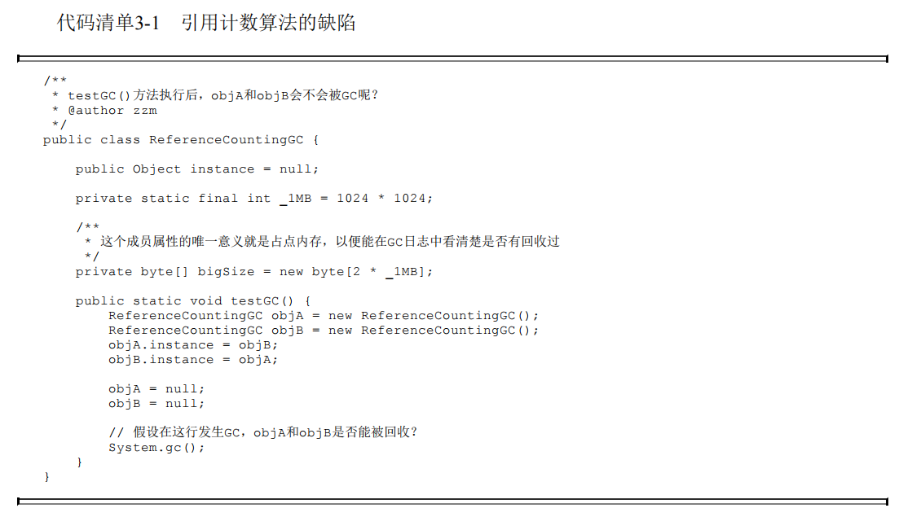
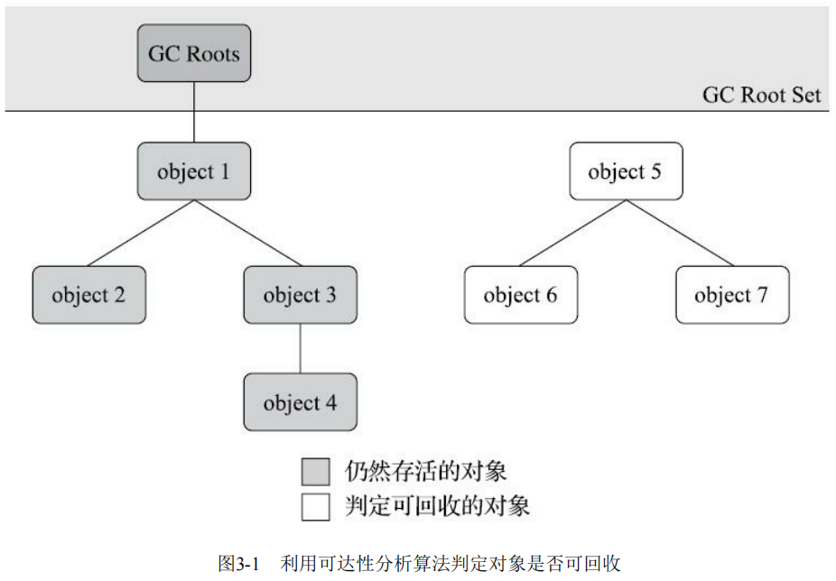
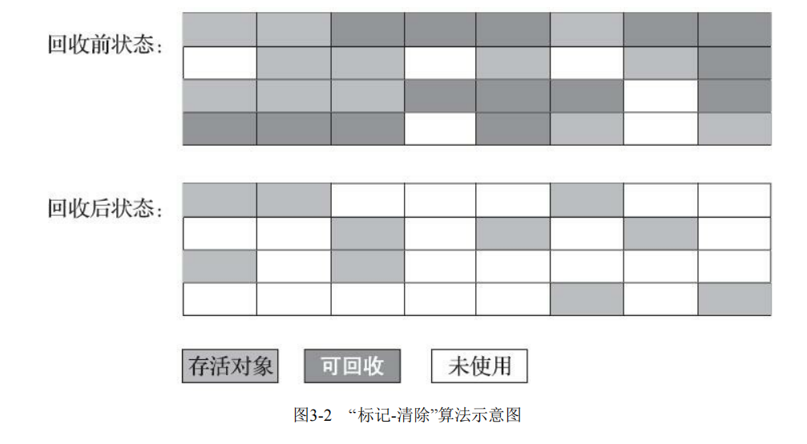
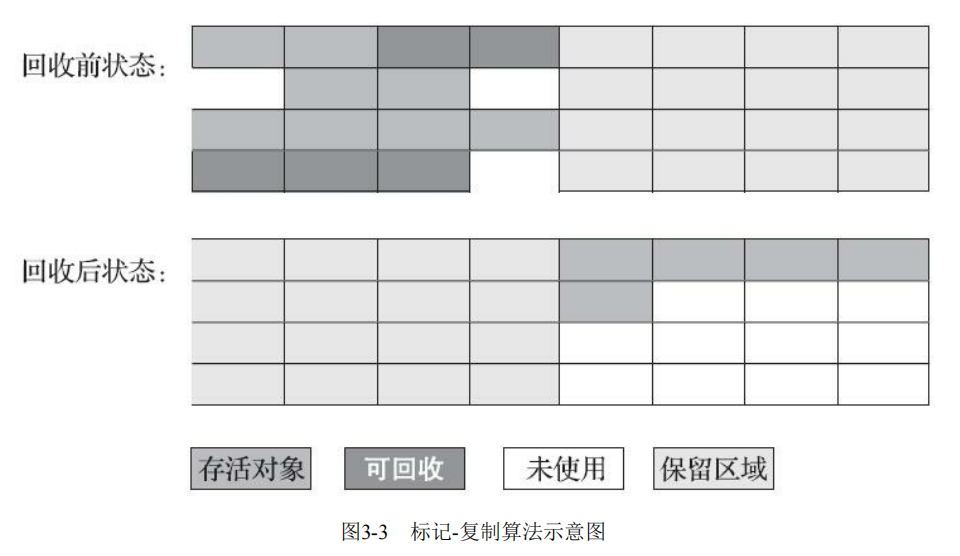

## JVM 当中是如何判断一个对象是垃圾

首先要想进行垃圾回收，前提是知道该对象是否是一个垃圾对象，因此在 JVM 当中有两种判断对象是否已死的策略，**引用计数法** 与 **可达性分析/根搜索算法** ，对于引用计数法而言，其本身是存在对象相互引用而无法被判断为垃圾对象的问题，如果大量的出现相互持有的对象，最终会导致内存泄漏，内存溢出的风险，因此该策略是不推荐使用的，在 JVM 当中默认是使用的另一种策略，**可达性分析算法** 。

**引用计数法**

引用计数法的原理很简单，就是每一个对象都有一个独属于自己的引用计数器，每当有一个地方引用了该对象，则该计数器就会 +1 ，而当引用失效则该计数器就会 -1 ，因此在任何时候当该对象的计数器 **为 0 则就表示该对象就是不可能在被使用了**，这里用代码解释一下这句话。

~~~ java
public static void main(String[] args) {
    Object A = new Object(); //这里创建了一个对象引用 A 指向了新创建的这个对象,因此这个对象的引用计数器 +1  = 1
    System.out.println("A="+A);
    Object B = A; //此时这里的引用 B 又指向了 A 的引用，而 A 又是引用了之前创建的对象计数器 +1  = 2
    System.out.println("B="+B);
    A = null; // A 取消了引用 -1 = 1
    B = null; // B 取消了引用 -1 = 0
    Object C = A; //此时 之间创建的 Object 对象无法再被引用,这里的 C = null
    System.out.println("C="+C);
}
~~~

> A=java.lang.Object@75828a0f
> B=java.lang.Object@75828a0f
> C=null

虽然客观的说，引用计数算法虽然占用了一些额外的内存空间来进行计数，但其因判断效率高，在绝大多数情况下其属于一个优秀的不错算法，但对于引入计数而言其存在一个较大的缺陷，比如对于 ObjA 与 ObjC 对象如果两个对象存在相互引用，即便实例在置为空的情况下，对象也无法通过引用计数将对象回收。

 

由于引用计数法存在这样的缺陷，所以 JVM 当中关于对象的是否死亡的判断使用了另一种策略，**可达性分析算法**

**可达性分析**

可达性分析的基本思路是通过一系列称为 **GC Roots** 的根对象作为起始节点，从这些节点开始，根据引用关系向下搜索，搜索过程所走过的路径称为 **引用链** ，而这条链路上的对象都是目前的存活对象，如果某个对象到 **GC Root** 间没有任何引用链相连，或者说从 **CG Root** 到这个对象不可达，则此对象是不可您再被使用的。

- 哪些对象作为 **GC Root** 
  1. 虚拟机栈（栈帧中的本地变量表）中引用的对象，譬如各个线程被调用的方法栈中使用到的参数、局部变量、临时变量等
  2. 方法区中类静态属性引用的对象，比如 Java 类的引用类型静态变量
  3. 方法区中常量引用的对象，比如字符串常量池里的引用
  4. 本地方法栈中 JNI 引用的对象
  5. Java 虚拟机内部引用，如基本数据类对于的 Class 对象
  6. 被同步锁（synchronization 关键字）持有的对象

**JDK1，2 版本之后的引用**

JDK 当中对引用的概念进行了细分，分为 强引用（Strongly Re-ference）、软引用（Soft Reference）、弱引用（Weak Reference）和虚引用（Phantom Reference），这 4 中引用强度依次减弱。

- 强引用 

  强引用就是传统意义上的引用，在代码当中普遍存在的一种引用赋值，既类似 “Object obj = new Object()” 这种引用关系，无论任何的情况下，只要强引用关系还在，垃圾收集器就永远不会回收掉被引用的对象。

~~~ java
Object obj = new Object();  // 强引用
obj = null;  // 取消强引用，对象可以被 GC 回收
~~~

- 软引用

  用来描述一些还有，但非必须的对象。只被软引用关联的对象，在系统将要发生内存溢出前，会把这些对象列进回收范围之中进行第二次回收，如果这次回收还没有足够的内存，才会抛出内存的溢出异常，适用于 **缓存** 场景，比如缓存图片、数据等，避免内存溢出。

~~~ java
SoftReference<Object> softRef = new SoftReference<>(new Object());
Object obj = softRef.get();  // 获取对象（可能为 null，如果被回收）
System.out.println(obj);      // 输出对象，如果内存不足可能返回 null
~~~

- 弱引用

  弱引用也是用来描述哪些非必须的对象，但是其强度比软引用更弱一些，被弱引用关联的对象只能能生存到下一次垃圾收集发生为止。当垃圾手机器开始工作，无论内存是否足够，都会回收掉只被弱引用关联的对象。

~~~ java
WeakReference<Object> weakRef = new WeakReference<>(new Object());
System.out.println(weakRef.get());  // 可能返回对象
System.gc();  // 触发 GC
System.out.println(weakRef.get());  // 很可能返回 null
~~~

- 虚引用

  虚引用被称为“幽灵引用”或“幻音引用”，是以上三种当中最弱的一种引用关系，一个对象是否有虚引用不对会其对象有任何生存的时候构成影响的，也无法通过虚引用获取一个实例对象。

~~~ java
ReferenceQueue<Object> queue = new ReferenceQueue<>();
PhantomReference<Object> phantomRef = new PhantomReference<>(new Object(), queue);
System.gc();  // 触发 GC
Reference<?> ref = queue.poll();  // 检查是否被回收
if (ref != null) {
    System.out.println("对象已被回收");
}
~~~

## Java 当中有哪些垃圾回收算法，都是在什么时候时机使用的

首先最早的是 **标记清除算法** 也是最基础的算法，从名字可以看到其主要是分为两步 **标记** 、**清除** 。首先标记出所有需要回收的对象，在标记完成之后，统一回收掉所有未被标记的对象。而标记的过程就是通过前面提到的判断对象引用关系来检查对象是否存活。

但其实主要是存在两个主要的缺点:

第一个是执行效率不稳定，如果 Java 堆中包含大量的对象，而且其中大部分都是需要被回收的，这时就必须进行大量标记和清除的动作，导致标记和清除两个过程的执行效率都会随着对象的数据增长而降低。

第二个是内存空间的碎片化问题，标记、清除之后会产生大量的不连续的内存空间碎片，空间碎片太多可能会导致当以后的程序在运行的过程中，如果需要分配较大的对象时，无法找到连续的内存空间而不得不提前触发另一次的垃圾回收动作。

 

然后对于 **标记复制算法** ，前面的对于 **标记清除算法** 在面临大量可回收对象的时候，会出现 **空间碎片** 与 **标记清除效率低** 这样的问题，而 **标记复制算法** 采用了一种 **半区复制** 的策列，其主要是 **将可用内存按照空间容量化为未大小相等的两块区域** ，每一只使用其中的一块。当这一块的内存用完之后，就将存活的对象全部复制到另一块区域当中，然后将其**原来的区域全部清除**。

但其实问题是，如果说内存当中的 **绝大多数对象** 都是存活的，这种算法将会产生大量的内存复制的开销，但对于绝大多数的对象都是可回收的情况，这种算法所占用的性能开销就很小，只需要在复制处理完移动栈顶指针就可以完成顺序的分配。

 

而对于现在商用的 Java 虚拟机而言，觉大多数都是采用了这种的垃圾回收策略。IDM 公司研究对新生代绝大多数都是 **朝生夕死** 的，因此
