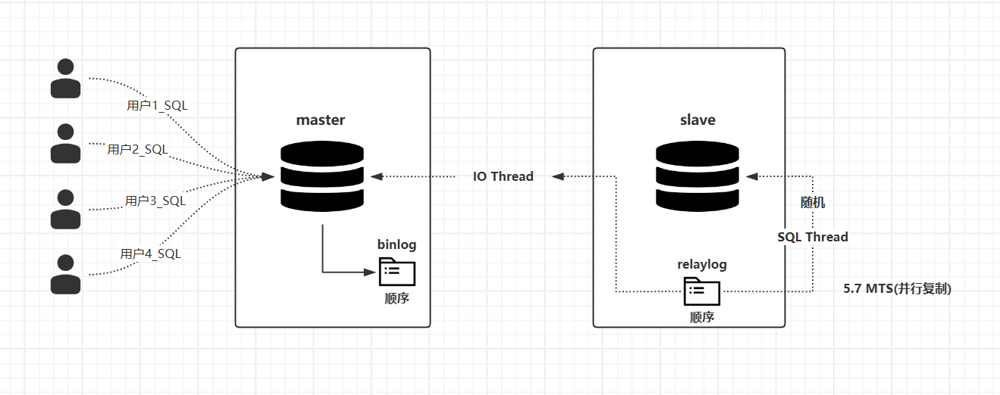
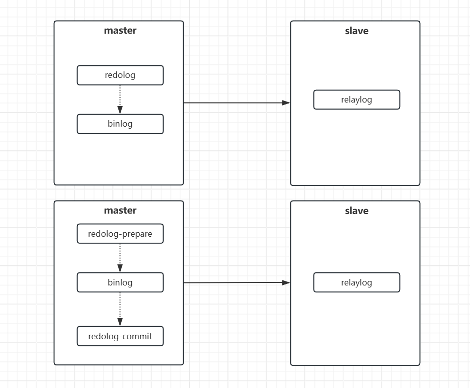

# MySQL 的事务机制

## 为什么MySQL 会存在relaylog这样的中继日志呢

**简单来说，Relay Log（中继日志）的核心目的是为了解耦，让“数据接收”和“数据应用”这两个步骤可以异步进行，从而提升可靠性、性能，并支持复杂的复制架构。**可以把它想象成一个**高效的“中间缓存队列”**。

### 1. 首先，没有Relay Log会怎样？

假设没有Relay Log，主库（Master）的二进制日志（Binlog）事件发送到从库（Slave）后，从库的I/O线程需要立即等待SQL线程将这些事件执行完毕，才能接收下一个事件。

这会带来几个严重问题：

- **性能瓶颈：** 主库必须等待从库执行完一个事件，才能发送下一个，复制速度受限于从库的应用速度。
- **可靠性差：** 如果SQL线程应用稍慢或卡住，会直接拖累I/O线程，导致无法及时接收新的Binlog事件，甚至可能造成网络连接超时中断。
- **无法支持多从库链式复制：** 一个从库无法同时扮演“接收者”和“转发者”的角色。

### 2. Relay Log 如何解决了这些问题？

Relay Log的引入，完美地将**数据接收（I/O线程）** 和**数据重放（SQL线程）** 这两个过程分开了。

这个过程如下：

1. **I/O线程 (负责拉取数据)：**
   - 连接主库，读取主库的Binlog事件。
   - **关键一步：** 将这些事件**立刻、尽快地**写入到从库服务器本地的Relay Log文件中。
   - 一旦写入成功，I/O线程就可以向主库发送ACK（确认），然后继续去拉取下一个事件，而**完全不需要关心SQL线程什么时候执行这些事件**。
   - 同时在 5.7 版本之后引入了新的MTS并发复制机制，使得从 relaylog 中将数据读数据效率变得更高。
2. **SQL线程 (负责应用数据)：**
   - 它独立地、按照自己的节奏，从本地的Relay Log文件中读取事件。
   - 将这些事件在从库的数据库引擎中重放（执行SQL或逻辑操作），实现数据同步。
   - 应用完后，它会定期清理已经处理过的Relay Log文件。

### 3. Relay Log 的核心目的与优势

基于上述流程，Relay Log的存在带来了以下几个至关重要的好处：

1. **解耦与异步化 (最重要的目的)**
   - **I/O线程**只负责高速网络传输和写本地文件，这是很快的操作。
   - **SQL线程**只负责本地数据库操作，速度可能慢一些（因为要保证数据一致性）。
   - 两者互不干扰。即使SQL线程暂时卡住（比如遇到一个大事务），I/O线程仍然可以持续地从主库拉取日志，不会造成主库的复制中断。这大大提升了复制的健壮性。
2. **网络与IO性能优化**
   - I/O线程可以批量地从主库获取数据，并顺序地写入Relay Log，极大减少了网络往返和磁盘寻址的开销。
   - SQL线程可以顺序地读取Relay Log，同样高效。
3. **充当缓冲区，应对突发流量**
   - 如果主库短时间内产生大量写操作（比如批量导入），Relay Log可以作为一个缓冲区，先存下来，让SQL线程慢慢消化，避免了数据丢失或复制延迟急剧增长。
4. **支持链式复制 (多级复制)**
   - 这是Relay Log另一个至关重要的用途。在一个 `A -> B -> C` 的复制架构中：
     - 服务器B既是主库A的从库，又是从库C的主库。
     - B服务器的**I/O线程**从A拉取Binlog，写入**Relay Log**。
     - B服务器的**SQL线程**应用Relay Log，同时B服务器自己也会产生**Binlog**。
     - 从库C再从B的Binlog中获取数据。
   - **如果没有Relay Log，B就无法同时处理来自A的接收和发给C的发送工作。**
5. **便于故障排查和数据恢复**
   - Relay Log是存储在从库本地的文件，如果SQL线程应用出错（比如主从数据不一致），可以方便地查看Relay Log的内容，定位是哪个事件出了问题

## 为什么需要 Redo Log?

**Redo Log（重做日志）的核心作用是：保证事务的持久性（Durability），确保即使数据库发生异常重启，已提交的事务所做的数据修改也不会丢失。**

它是一种 **预写式日志（Write-Ahead Logging, WAL）** 技术的核心实现。

要理解 redo log，首先要明白数据库面临的一个核心性能矛盾：

- **数据安全 vs. 写入性能**
  - **数据安全**：为了保证数据不丢失，每次事务提交时，都必须把修改过的数据页**直接刷回磁盘**。这个操作因为涉及随机 I/O，速度非常慢。
  - **写入性能**：如果每次提交都要刷盘，数据库的写入性能会急剧下降，无法承受高并发场景。

### Redo Log 的工作原理

它的工作方式可以概括为以下几步：

1. **记录日志而非直接写盘**：
   当有一条 SQL 语句（如 `UPDATE`）要修改某页（Page）中的数据时：
   - InnoDB 引擎并不会直接去磁盘上修改这页数据。
   - 而是会先将 **“在某个数据页上做了什么修改”** 这个操作记录到 redo log buffer（内存中的缓冲区）中。
   - 例如：`“对表空间xx、页号xx、偏移量xx处的数据更新为xxx”`。
   - 注意：这里记录的的是**物理逻辑日志**，是物理到页、逻辑到页内记录的。
2. **日志先行（Write-Ahead）**：
   在事务提交时（或更早），**必须先将 redo log buffer 中的相关日志记录刷盘**（`innodb_flush_log_at_trx_commit` 参数控制策略，通常为1，即提交时刷盘）。这就是“预写式日志”的含义——**数据页的修改落盘前，其对应的日志必须先行落盘**。
3. **后台刷脏页**：
   此时，事务已经提交成功，保证了持久性。而那个被修改过的数据页（此时它在内存的 Buffer Pool 中，被称为“脏页”），InnoDB 会有**后台线程在合适的时机**（比如系统空闲时）**慢慢地将这些脏页刷回到磁盘**的数据文件中。
4. **崩溃恢复（Crash Recovery）**：
   如果数据库在脏页刷盘之前突然宕机或重启了，会发生什么？
   - 重启后，InnoDB 会检查磁盘上的 redo log 文件。
   - 它会**重放（redo）** 所有已提交但尚未应用（即脏页未刷盘）的日志记录。
   - 通过重复这些物理操作，将数据页恢复到宕机前的状态，从而保证了已提交事务的数据不丢失。

### Redo Log 的特点

1. **顺序写入**：Redo log 是追加到文件末尾的，属于**顺序 I/O**。顺序写入磁盘的速度远快于随机写入（数据文件通常是随机 I/O）。这是它提升性能的关键。
2. **固定大小，循环写入**：Redo log 文件是由多个（通常是2个或4个）固定大小的文件组成的。当写满第一个文件后，会切换到第二个文件继续写；当所有文件都写满后，会**循环覆盖**第一个文件。但覆盖的前提是，对应的脏页已经被刷到了磁盘，这些日志就不再需要用于恢复了。
3. **物理逻辑日志（Physiological Logging）**：它不是纯粹的物理日志（记录字节变化），也不是逻辑日志（记录SQL语句），而是介于两者之间。它记录了**对哪个页、做了什么操作**，这使得它既高效又具有通用性。

------

### 总结：Redo Log 的主要作用

1. **确保事务持久性（Durability）**：这是最根本的作用。通过崩溃恢复机制，保证已提交事务的数据100%不丢失。
2. **大幅提升数据库写入性能**：将**随机写磁盘**（修改数据页）转换为了**顺序写磁盘**（写日志），再加上**组提交（Group Commit）** 等优化技术，使得数据库在高并发写入场景下依然能保持高性能。
3. **协调 Checkpoint 机制**：Redo log 的大小是有限的，它通过与 Checkpoint 机制配合，标记哪些日志对应的脏页已经刷盘，从而可以安全地覆盖旧的日志，实现日志文件的循环使用。

**一个简单的比喻：**

> 如果把数据库的修改操作比作在课堂上记笔记。
>
> - **没有 redo log**：每听老师讲一句话（一个事务），就马上整理到正式的笔记本（数据文件）上，动作慢，效率低。
> - **有 redo log**：先快速地记在草稿纸（redo log）上（顺序写，快），下课后再根据草稿纸工整地誊写到正式笔记本上（后台刷脏页）。即使下课铃响时突然停电（宕机），只要草稿纸没丢，依然能恢复所有笔记内容。

## 为什么在写日志是如何解决断电导致数据读取不一致的

当我们的 master 主节点断电之后，slave 从服务会在连接之后读取 redolog 当中的数据，将其最新的数据刷新到从节点。但其实这样是存在一个问题的，就是当前一条记录过来，是应该先写 redolog 还是 binlog 呢？假设这里就采用的是图一当中的模型，如果先写 redolog ，比如 redolog + 1，正要写 binlog + 1 时主服务宕机，此时当主服务重启之后，主服务会从 binlog 当中读取并恢复数据，而 slave 从服务会拉取 redolog 当中的数据，但问题是由于 redolog 与 binlog 此时两个当中的数据并不同步，这就会导致master服务启动之后，主节点与从节点当中的数据并不一致，同样的道理对于先更新 binlog 再更新 redolog ，更新 redolog 的时候master宕机也会产生同样的数据不一致问题。

因此为了解决这样的问题，就需要一个新的模型来取代当前的这种模型的架构设计，因此就有了图二当中的 redolog-prepare 与 redlog-commit 这种新的模型架构，这里同样假设无论先同步哪一个，并且在这期间服务产生了宕机，但是无论怎么最终的 redlog-commit 当中的数据一定是同步的，而从节点在拉取数据的时候是从 redlog-commit 当中读取，这就确保了在任何的情况下宕机都不会出现数据不同步的问题。

