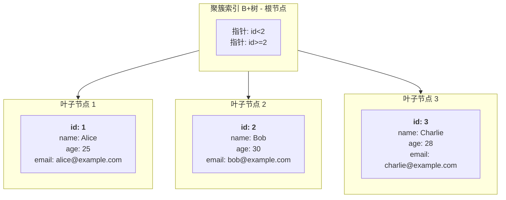
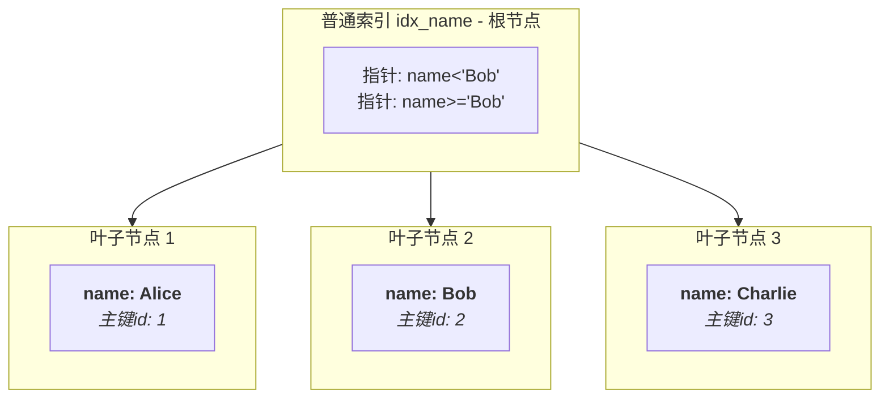

# MySQL 索引相关

## 关于MySQL 查找数据非叶子节点而导致命中索引之后的回表操作

### 示意图与说明

假设我们有一张用户表 `users`，结构如下：

| id (PRIMARY KEY) | name    | age  | email               |
| :--------------- | :------ | :--- | :------------------ |
| 1                | Alice   | 25   | alice@example.com   |
| 2                | Bob     | 30   | bob@example.com     |
| 3                | Charlie | 28   | charlie@example.com |

**1. 聚簇索引 (Clustered Index) - 根据主键 `id` 构建**

叶子节点直接存储整行数据。



**2. 普通索引 (Secondary Index) - 根据 `name` 列构建**

叶子节点只存储索引列（`name`）的值和对应的主键值（`id`）。



---

### 查询过程：回表 (Bookmark Lookup)

这个结构决定了使用普通索引查询数据的过程：

**查询：`SELECT * FROM users WHERE name = 'Bob';`**

1.  **查找普通索引**：优化器首先遍历 `idx_name` 索引树，找到 `name = 'Bob'` 的叶子节点。
2. 获取主键值：从该叶子节点中，获取到对应的**主键值 `id = 2`**。
3.  **回表查询**：拿着这个 `id = 2` 的值，回到**聚簇索引树**中再次进行查找。
4.  获取完整数据：在聚簇索引中定位到 `id = 2` 的叶子节点，从而获取到该行所有列（`id`, `name`, `age`, `email`）的完整数据。

**这个过程第二步中的“回到聚簇索引查找”就叫做回表（Bookmark Lookup）**。

## MySQL为什么需要预留这20%的空间

B+树索引的优势在于高效的增删改查，但这建立在它是一个**动态平衡**的数据结构之上。当你在已有的、已经填满100%的页面中插入新数据时，会立即触发一个昂贵的操作：**页面分裂（Page Split）**,之索引预留20% 的空间就是为了 **“在已有的节点当中插入元素的时候，保证节点的空间是足够的”** 。

- **页面分裂过程**：一个已满的页（例如16KB）需要插入新数据时，InnoDB会：
  1. 分配一个新的空白页。
  2. 将原页中大约一半的数据移动到新页中。
  3. 将新记录插入到合适的页中。
  4. 在父节点（非叶子节点）中添加一个新的指针条目以指向新页。如果父页也满了，可能还会导致父页分裂，这个过程可能会向上递归。
- **页面分裂的代价**：
  - **性能开销**：分裂操作本身需要CPU计算和大量的磁盘I/O（读写多个页）。
  - **空间浪费**：分裂后，两个页都只使用了大约50%的空间，导致空间利用率下降和碎片化。
  - **降低查询效率**：数据分布更分散，可能影响缓存的效率和范围查询的性能。

### `innodb_fill_factor=80` 如何解决这个问题？

通过在**索引构建阶段（Bulk Load）** 就主动地只填充每个页面的80%，您实际上是进行了一次“预先的空间规划”。

- **创造缓冲地带**：每个新创建的叶子页和非叶子页都自动拥有了20%的闲置空间。
- **避免或延迟分裂**：后续的`INSERT`和`UPDATE`操作可以优先利用这预留的20%空间。这极大地**减少甚至避免了**在数据刚插入后不久就发生页面分裂的概率。

------

### 与索引构建三个阶段的关系

这个参数的有效性，高度依赖于我们之前讨论的**有序索引构建（三个阶段）**。

1. **高效的基础**：正因为索引构建的第三阶段是拿着一个**全局有序的列表**来批量填充B+树，设置 `innodb_fill_factor` 才有意义。系统可以精确地计算在哪个点停止填充当前页（达到80%），然后切换到下一个新页。
2. **如果是随机插入**：*<u>在无序插入的情况下，即使你设置了80%的填充因子，也无法有效规划，因为无法预测未来的插入是落在页的中间、开头还是末尾，预留的空间可能根本不在需要它的地方</u>*。

### 适用场景

这个设置特别适用于：

- **写多读少的表**：已知表在创建后会有大量的写入操作。
- **数据频繁更新的表**：特别是索引列的值会被更新的场景。
- 你希望用**额外的空间**来换取**更稳定、更高效的写入性能**。

> `innodb_fill_factor` 是一个**前瞻性的优化参数**。它通过在索引创建时“主动浪费”一部分空间（只填满80%），来为未来的数据增长预留空间，从而**换取运行时更低的页面分裂概率、更高的写入性能以及更稳定的空间利用率**。这是一个非常经典的“空间换时间”的优化策略。

## 最左匹配原则

假设一个表建立所有的顺序是先字段 A 后字段 B，在进行查询的时候无论查询的条件是 A AND B 或 B AND A ，都是会命中到索引的，由于在将数据交给执行引擎执行之前，客户端提交的 SQL语句都是会经过优化器进行执行语句的优化，将其 B AND A 在执行之前自动优化调整为 A AND B 去进行执行。

### 回表导致“最左匹配失效”

在最左匹配原则当中除了，一些简单的匹配失效另外还有一种存在的可能，我们来看一个例子

~~~ sql
CREATE TABLE `user` (
  `id` int PRIMARY KEY,           -- 主键
  `name` varchar(20),             -- 姓名
  `age` int,                      -- 年龄
  `city` varchar(20),             -- 城市
  KEY `idx_name_age` (`name`, `age`) -- 联合索引 (name, age)
) ENGINE=InnoDB;
~~~

假设表里有 100 万条数据。而执行下面的这条语句，由于 `id, name, age` 这三个数据在二级索引的叶子节点恰好是存在的，**覆盖索引**！引擎在二级索引上就拿到了所有需要的数据，**无需回表**。速度极快。

~~~ sql
SELECT id, name, age FROM user WHERE name = '张三' AND age = 25;
~~~

**“失效”的临界点：**

但是如果是下面这种情况，虽然说 name 可以命中到索引，但是如果命中之后 `李` 的数据量非常大的时候，还是需要进行回表操作，假设匹配到了90万条数据，对于MySQL而言，执行 90万 次的回表对 I/O 的消耗量是非常巨大的，因此优化器就会**放弃使用** `idx_name_age` 这个联合索引，转而进行全表扫描。

~~~ sql
SELECT * FROM user WHERE name = ‘李’; -- 查询所有姓李的人的所有信息
~~~

### 索引最左失效规则

假设我们有一个表 `users`，并为其创建了一个组合索引 `idx_composite`：

```sql
CREATE INDEX idx_composite ON users (country, city, age);
```

这个索引在磁盘上大致是按照 `(中国, 北京, 20)`, `(中国, 北京, 21)`, `(中国, 上海, 25)`, `(美国, 纽约, 30)`... 这样的顺序存储的。

### 不同查询条件的使用情况分析

我们来分析几种不同的查询条件，看看是否会命中索引 (`idx_composite (country, city, age)`)：

| 查询条件 (WHERE 子句)                                   | 是否命中索引？  | 原因说明                                                     |
| :------------------------------------------------------ | :-------------- | :----------------------------------------------------------- |
| `WHERE country = '中国'`                                | **✅ 是**        | 使用了索引的最左字段 `country`。这是最理想的情况。           |
| `WHERE country = '中国' AND city = '北京'`              | **✅ 是**        | 使用了索引的前两个字段，完全遵循了顺序。                     |
| `WHERE country = '中国' AND city = '北京' AND age = 25` | **✅ 是**        | 使用了所有三个字段，完美命中。                               |
| `WHERE country = '中国' AND age = 25`                   | **✅ 是 (部分)** | 使用了最左字段 `country`。对于 `age`，因为 `city` 缺失导致中断，索引无法用于精确查找 `age`，但可以用于过滤出所有 `country='中国'` 的记录，然后再通过回表查询来筛选 `age=25`。这被称为 **索引过滤(Index Filtering)**。 |
| `WHERE city = '北京'`                                   | **❌ 否**        | **没有使用最左字段 `country`**。这就像在没有按字母顺序排列的电话簿里直接找名字，无法利用索引的有序性，因此数据库通常会进行**全表扫描**。 |
| `WHERE city = '北京' AND age = 25`                      | **❌ 否**        | 同样，缺少最左字段 `country`，无法利用索引的有序性。         |
| `WHERE age = 25`                                        | **❌ 否**        | 缺少最左字段 `country` 和 `city`                             |

## 索引下推

### 1. 没有索引下推（MySQL 5.6 之前）是如何工作的？

我们沿用之前订单表的例子和索引 `idx_user_status (user_id, status)`。

**查询语句：**

```sql
SELECT * FROM user_orders WHERE user_id = 10086 AND product_id > 100;
```

注意：`product_id` 字段**不在** `idx_user_status` 索引中。

**没有ICP时的执行流程：**

1.  **存储引擎**：根据索引 `idx_user_status`，定位所有 `user_id = 10086` 的记录（比如找到 10,000 条）。
2.  **存储引擎 -> 服务器层**：将这 **10,000 条记录的主键（order_id）** 和**索引列（user_id, status）** 返回给 MySQL 服务器层。
3.  **服务器层**：根据这 10,000 个主键，**逐条回表**（访问聚簇索引）去读取完整的行数据。
4.  **服务器层**：对读取到的完整数据行，执行 `product_id > 100` 的过滤条件，最终得到满足条件的结果。

**问题所在：**
在第3步，存储引擎**盲目地**将所有 `user_id=10086` 的记录都进行了回表，**即使其中很多记录的 `product_id` 可能根本不大于100**。这造成了大量**无效的回表操作**，浪费了大量 I/O 资源。

---

### 2. 有索引下推（MySQL 5.6+）是如何工作的？

**同样的查询，同样的索引。**

**有ICP时的执行流程：**

1.  **存储引擎**：根据索引 `idx_user_status`，定位所有 `user_id = 10086` 的记录（找到 10,000 条）。
2.  **索引下推生效**：在存储引擎层，**不会立即回表**。它会利用索引中已经存在的列（本例中只有 `user_id` 和 `status`）来尝试执行 `WHERE` 子句中**剩下的、索引之外的过滤条件**（本例中是 `product_id > 100`）。
    *   *等等，`product_id` 不在索引里，怎么过滤？*
    *   **关键点**：存储引擎发现它无法用索引判断 `product_id > 100`，但它**并不会放弃**。它会把这 10,000 条记录中**所有可能满足条件**的主键id先拿出来。
3.  **存储引擎 -> 服务器层**：将**可能满足 `product_id > 100` 条件**的记录的主键（比如现在只有 2,000 条）返回给服务器层。*（注意：这里只是“可能”满足，因为引擎无法百分百确认，但它会做一个初步筛选）*
4.  **服务器层**：根据这 **2,000 个** 主键，**逐条回表**去读取完整的行数据。
5.  **服务器层**：对读取到的完整数据行，**再次执行** `product_id > 100` 的过滤条件（这次是精确判断），得到最终结果。

**带来的巨大好处：**

*   **回表次数从 10,000 次降到了 ~2,000 次**。
*   大大减少了存储引擎和服务器层之间需要传输的数据量。
*   显著降低了不必要的磁盘 I/O，提升了查询性能，尤其是对于像 `user_id=10086` 这样筛选出大量记录但其他条件过滤性很强的查询。

---

### MySQL 的5.1 版本与 5.7 版本关于文件存储的区别

在 5.1 版本的 MySIME 存储引擎，data 目录下有两个文件，一个是存储 Key 另一个存储 Value。而在 5.7 版本使用 InnoDB 存储引擎 data 目录下将 key 与 Value 放在同一个目录下。

## 索引的匹配原则

### 索引前缀

索引前缀在索引建立的过程当中是具有相当重要的作用的，为了节约存储页的大小，选择合适的索引前缀可以让索引文件变小的多。因此在实际业务当中，对于索引列作为前缀的就需要选择一个合适的索引前缀，在保证命中覆盖率达到客观的前提下，而保证索引的前缀尽可能的短。

测试数据来源 MySQL 官网的 [MySQL :: Other MySQL Documentation](https://dev.mysql.com/doc/index-other.html) 目录下的 **sakila database**

~~~ sql 
#从mysql的官网中下载skila数据库，这个数据库中有一个叫做city的数据表
#创建数据表
create table citydemo(city varchar(50) not null);
insert into citydemo(city) select city from city;

# 重复执行5次下面的sql语句
insert into citydemo(city) select city from citydemo;

#更新城市表的名称
update citydemo set city=(select city from city order by rand() limit 1);

#查找最常见的城市列表，发现每个值都出现45-65次，
select count(*) as cnt,city from citydemo group by city order by cnt desc limit 10;

#查找最频繁出现的城市前缀，先从3个前缀字母开始，发现比原来出现的次数更多，可以分别截取多个字符查看城市出现的次数
select count(*) as cnt,left(city,3) as pref from citydemo group by pref order by cnt desc limit 10;
select count(*) as cnt,left(city,7) as pref from citydemo group by pref order by cnt desc limit 10;
#此时前缀的选择性接近于完整列的选择性

#还可以通过另外一种方式来计算完整列的选择性，可以看到当前缀长度到达7之后，再增加前缀长度，选择性提升的幅度已经很小了
select count(distinct left(city,3))/count(*) as sel3,
count(distinct left(city,4))/count(*) as sel4,
count(distinct left(city,5))/count(*) as sel5,
count(distinct left(city,6))/count(*) as sel6,
count(distinct left(city,7))/count(*) as sel7,
count(distinct left(city,8))/count(*) as sel8 
from citydemo;

#计算完成之后可以创建前缀索引
alter table citydemo add key(city(7));

#注意：前缀索引是一种能使索引更小更快的有效方法，但是也包含缺点：mysql无法使用前缀索引做order by 和 group by。 
~~~

随着选择的前缀数量增加，最终的匹配值也是趋于增长的趋势，但最终会到一个确定值，而这个确定的值对应的前缀最小数量就是最可观的索引前缀截取值。

| sel3   | sel4   | sel5   | sel6   | sel7   | sel8   |
| ------ | ------ | ------ | ------ | ------ | ------ |
| 0.1892 | 0.2342 | 0.2438 | 0.2471 | 0.2483 | 0.2483 |

## 通过执行计划进行 SQL 语句的优化

### 通过执行计划查询索引的长度 key_len

在 SQL 优化当中索引的长度 key_len 也是需要关心的一个点，虽然多对于非字符串类型的单个字段进行建立索引的时候，由于本身占用的空间极小，所以不需要进行关注，但是如果我们一旦采用联合索引，将多个字段一起建立索引，这种情况下我们为了尽最大可能的保证占用内存空间最小，就需要对索引的长度做一些考虑了。

让我们用下面的这个案例做演示：

~~~ sql
#创建一个user
CREATE TABLE `user` (
  `id` int PRIMARY KEY,           -- 主键
  `name` varchar(20),             -- 姓名
  `age` int,                      -- 年龄
  `city` varchar(20),             -- 城市
  KEY `idx_name_age` (`name`, `age`) -- 联合索引 (name, age)
) ENGINE=InnoDB;

# 删除旧的索引
drop index idx_name_age ON user;

# 建立新的联合索引
alter table user add index idx_nac(name,age,city);

# 查询当前建立的索引
show index from user;

# 查询索引的命中计划
explain select * from user where name='kaka' and age =18 and city ='地球';
~~~

| #    | id   | select_type | table | partitions | type | possible_keys | key     | key_len | ref               | rows | filtered | Extra       |
| ---- | ---- | ----------- | ----- | ---------- | ---- | ------------- | ------- | ------- | ----------------- | ---- | -------- | ----------- |
| 1    | 1    | SIMPLE      | user  |            | ref  | idx_nac       | idx_nac | 171     | const,const,const | 1    | 100      | Using index |

通过执行计划打印的结果可以看到，当前的 key_len = 171 ，这个值是由于

#### 1. 计算 `name varchar(20)` 的长度

- `varchar` 是变长字符串。
- 对于 `varchar(N)`，存储时需要额外消耗 **2个字节** 来存储字符串的实际长度（如果N>255则需2字节，<255则需1字节，但MySQL 5.0+之后统一为2字节）。
- 字符集 `utf8mb4` 中，**一个字符最大占用 4 个字节**。
- 该列**没有** `NOT NULL` 约束，所以**允许为NULL**，需要额外 **1个字节** 作为NULL标志位。

所以 `name` 列的长度为：
`长度 = 20字符 * 4字节/字符 + 2长度字节 + 1NULL字节 = 80 + 2 + 1 = 83`

#### 2. 计算 `age int` 的长度

- `int` 类型固定占用 **4个字节**。
- 该列**没有** `NOT NULL` 约束，所以允许为NULL，需要额外 **1个字节**。

所以 `age` 列的长度为：
`长度 = 4字节 + 1NULL字节 = 5`

#### 3. 计算 `city varchar(20)` 的长度

计算方式与 `name` 列完全相同：
`长度 = 20字符 * 4字节/字符 + 2长度字节 + 1NULL字节 = 80 + 2 + 1 = 83

## 在平时开发当中是如何使用执行计划的？

可以按照 **“原则 -> 流程 -> 案例 -> 总结”** 的思路来组织你的回答。

**开场白：**
“在我的实际开发中，使用 `EXPLAIN` 分析SQL性能是我进行数据库优化的常规操作。我通常不会等到线上出问题了才去看，而是在开发阶段、Code Review阶段或者发现慢查询日志告警时，就会主动去分析。我的排查过程可以总结为一个四步法：**定位问题、解读计划、分析瓶颈、实施优化**。”

---

### 第一步：定位问题 (Identify the Problem)

“首先，我不会漫无目的地去`EXPLAIN`每一条SQL。我通常会先锁定目标：

1.  **慢查询日志 (Slow Query Log)**：这是最主要的入口。我会配置并定期查看慢查询日志，找出那些执行时间超过阈值的SQL语句。
2.  **业务反馈**：当应用侧反馈某个页面或接口加载缓慢时，我会通过APM工具（如SkyWalking、Pinpoint）或监控系统（如Prometheus+Grafana）定位到对应的慢SQL。
3.  **代码审查 (Code Review)**：在Review同事的代码时，如果看到复杂的联表查询、深分页或者没有索引的查询条件，我会主动建议对方加上`EXPLAIN`看一下执行计划。”

**（向面试官展示你是有主动发现问题的手段的，而不是被动等待）**

---

### 第二步：解读计划 (Read the Explain Plan)

“拿到目标SQL后，我的第一步一定是使用 `EXPLAIN` 或者 `EXPLAIN ANALYZE`（MySQL 8.0+）来获取执行计划。我重点关注以下几个核心字段，它们能快速告诉我瓶颈可能在哪里：

1.  **type**：**这是我最先看的字段**。我会心里有一个性能排序：
    *   如果看到 `ALL`（全表扫描），我就知道**大概率是缺索引**了。
    *   如果看到 `index`（全索引扫描），我会检查是不是可以优化为范围扫描。
    *   我的目标是让查询至少达到 `range` 级别，最好能达到 `ref` 或 `eq_ref`。

2.  **key & key_len**：
    *   `key` 告诉我查询实际使用的索引。如果为`NULL`，说明没用到索引。
    *   `key_len` **极其重要**。它告诉我索引是否被充分使用。比如我有一个联合索引 `idx(a,b,c)`，如果 `key_len` 很短，说明只用了索引的前一部分，后面的 `c` 列没用到，这时我就会检查我的`WHERE`条件是否没提供`c`列。

3.  **rows**：它预估了需要扫描的行数。这个值如果非常大，比如几万、几十万，那这条查询肯定是有问题的，需要优化。

4.  **Extra**：这里有很多关键信息：
    *   `Using filesort`：说明需要额外的排序操作，通常意味着`ORDER BY`的字段没有用到索引。
    *   `Using temporary`：说明需要创建临时表，常见于`GROUP BY`和排序操作，性能杀手。
    *   `Using index`：这是好消息，说明实现了**覆盖索引**，不需要回表，性能很好。”

**（这部分展示你对`EXPLAIN`输出结果有深刻的理解，知道每个字段背后的含义）**

---

### 第三步：分析瓶颈与实施优化 (Analyze & Optimize)

“根据`EXPLAIN`的结果，我会采取具体的优化措施，这通常是一个迭代的过程：

*   **场景一：发现 `type: ALL` 或 `key: NULL`**
    *   **分析**：缺少合适的索引。
    *   **行动**：根据 `WHERE` 子句、`ORDER BY`/`GROUP BY` 子句创建索引。我会优先考虑创建联合索引，并注意**最左前缀原则**。

*   **场景二：发现 `Using filesort` 或 `Using temporary`**
    *   **分析**：排序和分组操作没有走索引。
    *   **行动**：检查是否可以为 `ORDER BY`/`GROUP BY` 的字段建立索引，或者调整现有索引的列顺序以覆盖排序需求。

*   **场景三：发现 `key_len` 小于预期**
    *   **分析**：联合索引没有完全命中。
    *   **行动**：检查查询条件是否满足最左前缀，或者是否因为对索引列做了函数计算（如 `WHERE YEAR(create_time) = 2023`）导致索引失效。

*   **场景四：虽然用了索引，但 `rows` 仍然很大**
    *   **分析**：索引的区分度（Cardinality）可能不高。
    *   **行动**：考虑使用区分度更高的列作为索引的前缀列。

**（这部分展示你不仅能发现问题，还能给出具体的、有针对性的解决方案）**

---

### 第四步：举例说明 (Give an Example)

“举个最近的例子吧。我们线上有个列表页接口变慢了，我通过慢查询日志找到了一条SQL。用`EXPLAIN`一看，`type`是`ALL`，正在全表扫描。它的`WHERE`条件里有一个`status`字段和一个`create_time`字段。

我分析后发现，`status`字段只有几个枚举值，区分度很低，而`create_time`的区分度很高。于是我没有单独为`status`建索引，而是创建了一个联合索引 `idx_status_time(status, create_time)`。

再次`EXPLAIN`，`type`变成了`range`，`key_len`也显示索引被正确使用，`rows`从几十万降到了几百。接口耗时立刻从几百毫秒降到了几十毫秒。”

**（用一个真实的案例来证明你的方法是行之有效的，这是最有说服力的部分）**

---

### 总结 (Conclusion)

“总之，我的排查思路是一个闭环：**从监控和日志中发现性能问题 -> 使用`EXPLAIN`定位数据库层面的瓶颈 -> 针对关键指标（type, key, key_len, Extra）进行分析 -> 提出并实施具体的优化方案 -> 再次验证效果**。我认为`EXPLAIN`不是一个孤立的命令，而是一个需要结合业务逻辑、数据分布和索引原理来综合运用的强大工具。”

这个回答体现了你的**系统性思维、实战经验和解决问题的能力**，远超仅仅背诵`EXPLAIN`字段的含义，一定会给面试官留下深刻印象。

## 关于扩展索引

> **扩展索引是一种“投资”策略。** 我们通过在一次索引创建操作中“投资”更多的列（占用稍多的磁盘空间），来换取未来多种查询场景下的“收益”（极快的查询速度、消除排序、避免回表），同时避免了维护多个冗余索引的代价。

### 典型场景与高级用法

你描述的场景是“扩展索引”最普遍的应用，除此之外，它还能优化更多类型的查询：

#### 1. 优化多条件筛选（你的场景）

- **原有查询**: `WHERE A = ?` (使用旧索引 `(A)`)
- **新出现查询**: `WHERE A = ? AND B = ?`
- **行动**: 将 `(A)` 扩展为 `(A, B)`。新查询可以快速定位到精确的数据块，性能极大提升。

#### 2. 优化排序（ORDER BY）或分组（GROUP BY）

- **原有查询**: `WHERE A = ?` (使用旧索引 `(A)`)
- **新出现查询**: `WHERE A = ? ORDER BY B DESC` 或 `WHERE A = ? GROUP BY B`
- **问题**: 旧查询虽然能用索引找到 `A=?` 的所有行，但这些行在物理存储上是无序的，MySQL 需要一块“临时空间”来为它们排序（`Using filesort`），效率很低。
- **行动**: 将 `(A)` 扩展为 `(A, B)`。由于索引内部已经是先按 `A` 再按 `B` 排序的，所以满足 `A=?` 的数据**天然就是按 `B` 排好序的**。MySQL 可以直接按顺序读取数据，消除了昂贵的排序操作（`Extra` 字段中的 `Using filesort` 会消失）。

#### 3. 实现覆盖索引（Covering Index）

- **查询**: `SELECT B FROM table WHERE A = ?`
- **如果只有索引 (A)**: MySQL 使用索引找到主键，再**回表**（回到主键聚集索引）去查找 `B` 的值。
- **如果将索引扩展为 (A, B)**: 所有需要的数据（`A` 和 `B`）在索引树中已经全部包含了。MySQL 只需要扫描索引就能拿到结果，**无需回表**，速度极快。这会在 `EXPLAIN` 的 `Extra` 字段中看到 `Using index`。

### 实际开发中的案例

假设我们有一张 `orders` 表，现在有一个索引 `idx_user` 在 `user_id` 上。

```sql
CREATE TABLE `orders` (
  `id` bigint PRIMARY KEY,
  `user_id` bigint NOT NULL,
  `status` varchar(10) NOT NULL,
  `amount` decimal(10,2) NOT NULL,
  `created_at` datetime NOT NULL,
  KEY `idx_user` (`user_id`) -- 现有索引
);
```

**场景：** 有一个高频查询是：“查找某个用户的最新订单”。
SQL 如下：

```sql
SELECT * FROM orders WHERE user_id = 123 ORDER BY created_at DESC LIMIT 10;
```

**分析：**

1. `EXPLAIN` 这个查询，会发现：
   - `key`: `idx_user` （用到了索引）
   - `Extra`: `Using filesort` （发生了文件排序，性能瓶颈！）
2. 原因：`idx_user` 索引只能快速找到 `user_id=123` 的所有订单，但这些订单在索引内部是按插入顺序排列的，而不是按 `created_at` 排序的。所以 MySQL 需要一块内存（或磁盘）对这些找到的记录进行额外的排序操作。

**解决方案：**

1. **方案A（新手）：新建一个索引**

   ```sql
   ALTER TABLE orders ADD INDEX idx_user_created_at (user_id, created_at);
   ```

   - **优点**：能完美解决问题。
   - **缺点**：`idx_user` 索引和 `idx_user_created_at` 索引的前缀是重复的（都是 `user_id`），造成了**冗余**。维护两个索引会占用更多磁盘空间，并在数据写入时降低性能。

2. **方案B（老手）：扩展现有索引** ✅

   ```sql
   -- 1. 先删除旧的单列索引
   DROP INDEX idx_user ON orders;
   -- 2. 创建一个新的、扩展后的联合索引
   ALTER TABLE orders ADD INDEX idx_user_created_at (user_id, created_at);
   ```

   - **优点**：
     - 新索引 `idx_user_created_at` 完全包含了旧索引 `idx_user` 的功能（因为满足最左前缀），所以删除旧索引不会影响基于 `user_id` 的查询。
     - 新索引完美支持了 `WHERE user_id = xxx ORDER BY created_at` 的查询，消除了 `Using filesort`。
     - **一箭双雕**：用一个索引干了过去两个索引的活，节省了空间，提高了写性能。

**这就是“扩展索引”的经典应用：通过将单列索引升级为更长的联合索引，来覆盖更多的查询路径，同时避免索引冗余。**

~~~ sql
CREATE TABLE t1 (
  i1 INT NOT NULL DEFAULT 0,
  i2 INT NOT NULL DEFAULT 0,
  d DATE DEFAULT NULL,
  PRIMARY KEY (i1, i2), # 主键
  INDEX k_d (d) # 二级索引
) ENGINE = InnoDB;

--向t1表中插入如下数据：
INSERT INTO t1 VALUES
(1, 1, '1998-01-01'), (1, 2, '1999-01-01'),(1, 3, '2000-01-01'), (1, 4, '2001-01-01'),
(1, 5, '2002-01-01'), (2, 1, '1998-01-01'),(2, 2, '1999-01-01'), (2, 3, '2000-01-01'),
(2, 4, '2001-01-01'), (2, 5, '2002-01-01'),(3, 1, '1998-01-01'), (3, 2, '1999-01-01'),
(3, 3, '2000-01-01'), (3, 4, '2001-01-01'),(3, 5, '2002-01-01'), (4, 1, '1998-01-01'),
(4, 2, '1999-01-01'), (4, 3, '2000-01-01'),(4, 4, '2001-01-01'), (4, 5, '2002-01-01'),
(5, 1, '1998-01-01'), (5, 2, '1999-01-01'),(5, 3, '2000-01-01'), (5, 4, '2001-01-01'),(5, 5, '2002-01-01');

--当优化器不考虑索引扩展时，它把索引k_d视为d，执行计划如下所示：
mysql> EXPLAIN SELECT COUNT(*) FROM t1 WHERE i1 = 3 AND d = '2000-01-01'\G
*************************** 1. row ***************************
           id: 1
  select_type: SIMPLE
        table: t1
   partitions: NULL
         type: ref
possible_keys: PRIMARY,k_d
          key: PRIMARY
      key_len: 4
          ref: const
         rows: 5
     filtered: 20.00
        Extra: Using where
1 row in set, 1 warning (0.00 sec)

mysql> SET optimizer_switch = 'use_index_extensions=on';
Query OK, 0 rows affected (0.01 sec)
--当优化器考虑扩展索引时，他会把k_d做为（d，i1,i2）
mysql> EXPLAIN SELECT COUNT(*) FROM t1 WHERE i1 = 3 AND d = '2000-01-01'\G
*************************** 1. row ***************************
           id: 1
  select_type: SIMPLE
        table: t1
   partitions: NULL
         type: ref
possible_keys: PRIMARY,k_d
          key: k_d
      key_len: 8
          ref: const,const
         rows: 1
     filtered: 100.00
        Extra: Using index
1 row in set, 1 warning (0.00 sec)

~~~

对于表 `t1`：

- **主键 (Primary Key)**: `(i1, i2)`
- **二级索引 `k_d`**: 你定义的只是 `(d)`

但在物理存储上，InnoDB 实际存储的 `k_d` 索引结构是：`(d, i1, i2)`

默认情况下，优化器可能不会考虑使用这个“隐藏”的扩展部分。但当您设置了 `SET optimizer_switch = 'use_index_extensions=on';` 后，优化器就“开窍”了。

优化器会意识到：**“哦，原来 `k_d` 这个索引不只是 `(d)`，它实际上是 `(d, i1, i2)`！那我可以用它来做更多事情。”**

## mysql不可见索引

不可见的索引根本不会被优化器使用，而是正常维护。默认情况下索引是可见的，使用不可见的索引可以测试删除索引对查询性能的影响，而不必进行破坏性的更改，如果发现需要索引，就必须撤销该更改。

默认情况下索引是可见的。为了显式地控制新索引的可见性，可以在create table、create index或alter table的索引定义中使用visible或者invisible关键字

```sql
--在创建表的时候指定索引不可见
mysql> CREATE TABLE t1 (
    ->   i INT,
    ->   j INT,
    ->   k INT,
    ->   INDEX i_idx (i) INVISIBLE
    -> ) ENGINE = InnoDB;
Query OK, 0 rows affected (0.02 sec)

--创建索引的时候指定不可见索引
mysql> CREATE INDEX j_idx ON t1 (j) INVISIBLE;
Query OK, 0 rows affected (0.00 sec)
Records: 0  Duplicates: 0  Warnings: 0

--通过alter语句创建不可见索引
mysql> ALTER TABLE t1 ADD INDEX k_idx (k) INVISIBLE;
Query OK, 0 rows affected (0.01 sec)
Records: 0  Duplicates: 0  Warnings: 0

--使用alter语句来修改索引的可见性
mysql> ALTER TABLE t1 ALTER INDEX i_idx INVISIBLE;
Query OK, 0 rows affected (0.00 sec)
Records: 0  Duplicates: 0  Warnings: 0

mysql> ALTER TABLE t1 ALTER INDEX i_idx VISIBLE;
Query OK, 0 rows affected (0.00 sec)
Records: 0  Duplicates: 0  Warnings: 0

```

如果想要查看索引是否可见，可以通过information_schema的statistics表或者show index语句来查看：

```sql
mysql> SELECT INDEX_NAME, IS_VISIBLE
    ->        FROM INFORMATION_SCHEMA.STATISTICS
    ->        WHERE TABLE_SCHEMA = 'optimizer' AND TABLE_NAME = 't1';
+------------+------------+
| INDEX_NAME | IS_VISIBLE |
+------------+------------+
| i_idx      | YES        |
| j_idx      | NO         |
| k_idx      | NO         |
+------------+------------+
3 rows in set (0.00 sec)

mysql> show index from t1;
+-------+------------+----------+--------------+-------------+-----------+-------------+----------+--------+------+------------+---------+---------------+---------+------------+
| Table | Non_unique | Key_name | Seq_in_index | Column_name | Collation | Cardinality | Sub_part | Packed | Null | Index_type | Comment | Index_comment | Visible | Expression |
+-------+------------+----------+--------------+-------------+-----------+-------------+----------+--------+------+------------+---------+---------------+---------+------------+
| t1    |          1 | i_idx    |            1 | i           | A         |           0 |     NULL |   NULL | YES  | BTREE      |         |               | YES     | NULL       |
| t1    |          1 | j_idx    |            1 | j           | A         |           0 |     NULL |   NULL | YES  | BTREE      |         |               | NO      | NULL       |
| t1    |          1 | k_idx    |            1 | k           | A         |           0 |     NULL |   NULL | YES  | BTREE      |         |               | NO      | NULL       |
+-------+------------+----------+--------------+-------------+-----------+-------------+----------+--------+------+------------+---------+---------------+---------+------------+
3 rows in set (0.00 sec)
```

使用不可见的索引可以测试删除索引对查询性能的影响，而不必进行破坏性的更改，如果发现需要索引，就必须撤销该更改。对于大型表来说，删除和重新添加索引代价高昂，而使索引可见和不可见则是快速的就地操作。

如果一个不可见的索引实际上是被优化器需要和使用的，有几种方式可以注意到它的缺失对表查询的影响：

1. 包含引用不可见索引的索引提示的查询会报错
2. performance schema显示受影响查询的工作负载有所增加
3. 查询有不同的执行计划
4. 查询出现在慢查询日志中，而以前没有出现在慢查询日志中

optimizer_switch系统变量的use_invisible_indexes标志控制优化器是否使用不可见索引来构建查询执行计划，如果值为off，表示优化器会忽略不可见索引，如果为on，表示优化器会考虑不可见索引

```sql
--优化器考虑不可见索引
mysql> EXPLAIN SELECT /*+ SET_VAR(optimizer_switch = 'use_invisible_indexes=on') */         i, j FROM t1 WHERE j >= 50\G
*************************** 1. row ***************************
           id: 1
  select_type: SIMPLE
        table: t1
   partitions: NULL
         type: range
possible_keys: j_idx
          key: j_idx
      key_len: 5
          ref: NULL
         rows: 1
     filtered: 100.00
        Extra: Using index condition
1 row in set, 1 warning (0.00 sec)

--优化器不考虑不可见索引
mysql> EXPLAIN SELECT i, j FROM t1 WHERE j >= 50\G
*************************** 1. row ***************************
           id: 1
  select_type: SIMPLE
        table: t1
   partitions: NULL
         type: ALL
possible_keys: NULL
          key: NULL
      key_len: NULL
          ref: NULL
         rows: 1
     filtered: 100.00
        Extra: Using where
1 row in set, 1 warning (0.00 sec)

```

当一张表没有显式的逐渐，但是在某一个not null的列上有唯一索引，那么是无法设置为不可见索引

```sql
--创建没有主键有唯一索引的表
mysql> CREATE TABLE t2 (
    ->   i INT NOT NULL,
    ->   j INT NOT NULL,
    ->   UNIQUE j_idx (j)
    -> ) ENGINE = InnoDB;
Query OK, 0 rows affected (0.03 sec)

--在唯一索引上配置不可见，会报错
mysql> ALTER TABLE t2 ALTER INDEX j_idx INVISIBLE;
ERROR 3522 (HY000): A primary key index cannot be invisible
--添加主键
mysql> ALTER TABLE t2 ADD PRIMARY KEY (i);
Query OK, 0 rows affected (0.02 sec)
Records: 0  Duplicates: 0  Warnings: 0
--此时可以在唯一索引上配置不可见索引
mysql> ALTER TABLE t2 ALTER INDEX j_idx INVISIBLE;
Query OK, 0 rows affected (0.00 sec)
Records: 0  Duplicates: 0  Warnings: 0

```

案例如下：

```sql
--表结构
mysql> create table f1 (id serial primary key, f1 int,f2 int );
Query OK, 0 rows affected (0.11 sec) 

--创建两个索引，默认可见
mysql> alter table f1 add key idx_f1(f1), add key idx_f2(f2);
Query OK, 0 rows affected (0.12 sec)
Records: 0 Duplicates: 0 Warnings: 0 

--查看创建表语句
mysql> show create table f1\G
*************************** 1. row ***************************
Table: f1
Create Table: CREATE TABLE `f1` (
`id` bigint(20) unsigned NOT NULL AUTO_INCREMENT,
`f1` int(11) DEFAULT NULL,
`f2` int(11) DEFAULT NULL， 
  PRIMARY KEY (`id`),
  UNIQUE KEY `id` (`id`),
  KEY `idx_f1` (`f1`),
  KEY `idx_f2` (`f2`)
) ENGINE=InnoDB DEFAULT CHARSET=utf8mb4 COLLATE=utf8mb4_0900_ai_ci
1 row in set (0.00 sec)

--编写个造数据的存储过程
DELIMITER $$
USE `optimizer`$$ 
CREATE PROCEDURE `sp_generate_data_f1`(
    IN f_cnt INT
)
BEGIN
      DECLARE i,j INT DEFAULT 0;
      SET @@autocommit=0;
      WHILE i < f_cnt DO
        SET i = i + 1;
        IF j = 100 THEN
           SET j = 0;
           COMMIT;
END IF;
        SET j = j + 1;
        INSERT INTO f1 (f1,f2) SELECT CEIL(RAND()*100),CEIL(RAND()*100);
END WHILE;
      COMMIT;
      SET @@autocommit=1;
END$$
DELIMITER ; 

--调用存储过程
mysql> call sp_generate_data_f1(10000);
Query OK, 0 rows affected (1.42 sec)

--将f2列上的索引变为不可见
mysql> alter table f1 alter index idx_f2 invisible;
Query OK, 0 rows affected (0.05 sec)
Records: 0 Duplicates: 0 Warnings: 0 

mysql> show create table f1 \G
*************************** 1. row ***************************
Table: f1
Create Table: CREATE TABLE `f1` (
`id` bigint(20) unsigned NOT NULL AUTO_INCREMENT,
`f1` int(11) DEFAULT NULL,
`f2` int(11) DEFAULT NULL,
  PRIMARY KEY (`id`),
  UNIQUE KEY `id` (`id`),
  KEY `idx_f1` (`f1`),
  KEY `idx_f2` (`f2`) /*!80000 INVISIBLE */
) ENGINE=InnoDB AUTO_INCREMENT=10001 DEFAULT CHARSET=utf8mb4 COLLATE=utf8mb4_0900_ai_ci
1 row in set (0.00 sec)
--执行sql
mysql> explain select count(*) from f1 where f2 = 52\G
*************************** 1. row ***************************
           id: 1
  select_type: SIMPLE
        table: f1
   partitions: NULL
         type: ALL
possible_keys: NULL
          key: NULL
      key_len: NULL
          ref: NULL
         rows: 9921
     filtered: 1.00
        Extra: Using where
1 row in set, 1 warning (0.00 sec)

--强制指定索引会报错
mysql> explain select count(*) from f1 force index (idx_f2) where f2 = 52\G
ERROR 1176 (42000): Key 'idx_f2' doesn't exist in table 'f1'

--设置参数，告诉优化器可以使用隐式索引
mysql> set @@optimizer_switch = 'use_invisible_indexes=on';
Query OK, 0 rows affected (0.00 sec)

--执行sql
mysql> explain select count(*) from f1 where f2 = 52\G
*************************** 1. row ***************************
           id: 1
  select_type: SIMPLE
        table: f1
   partitions: NULL
         type: ref
possible_keys: idx_f2
          key: idx_f2
      key_len: 5
          ref: const
         rows: 107
     filtered: 100.00
        Extra: Using index
1 row in set, 1 warning (0.00 sec)
```
