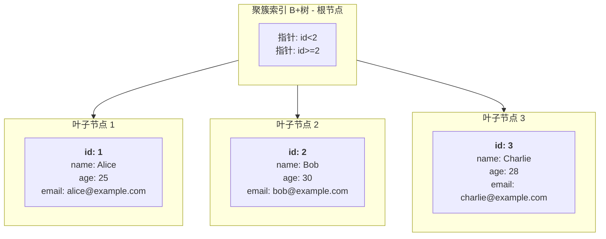
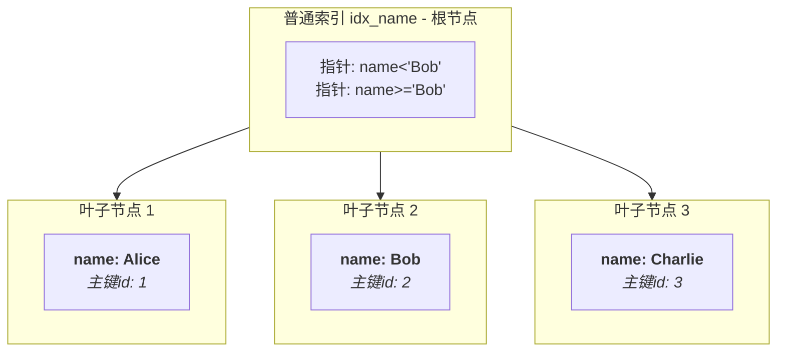

# MySQL 索引相关

## 关于MySQL 查找数据非叶子节点而导致命中索引之后的回表操作

### 示意图与说明

假设我们有一张用户表 `users`，结构如下：

| id (PRIMARY KEY) | name    | age  | email               |
| :--------------- | :------ | :--- | :------------------ |
| 1                | Alice   | 25   | alice@example.com   |
| 2                | Bob     | 30   | bob@example.com     |
| 3                | Charlie | 28   | charlie@example.com |

**1. 聚簇索引 (Clustered Index) - 根据主键 `id` 构建**

叶子节点直接存储整行数据。



**2. 普通索引 (Secondary Index) - 根据 `name` 列构建**

叶子节点只存储索引列（`name`）的值和对应的主键值（`id`）。



---

### 查询过程：回表 (Bookmark Lookup)

这个结构决定了使用普通索引查询数据的过程：

**查询：`SELECT * FROM users WHERE name = 'Bob';`**

1.  **查找普通索引**：优化器首先遍历 `idx_name` 索引树，找到 `name = 'Bob'` 的叶子节点。
2. 获取主键值：从该叶子节点中，获取到对应的**主键值 `id = 2`**。
3.  **回表查询**：拿着这个 `id = 2` 的值，回到**聚簇索引树**中再次进行查找。
4.  获取完整数据：在聚簇索引中定位到 `id = 2` 的叶子节点，从而获取到该行所有列（`id`, `name`, `age`, `email`）的完整数据。

**这个过程第二步中的“回到聚簇索引查找”就叫做回表（Bookmark Lookup）**。

## MySQL为什么需要预留这20%的空间

B+树索引的优势在于高效的增删改查，但这建立在它是一个**动态平衡**的数据结构之上。当你在已有的、已经填满100%的页面中插入新数据时，会立即触发一个昂贵的操作：**页面分裂（Page Split）**,之索引预留20% 的空间就是为了 **“在已有的节点当中插入元素的时候，保证节点的空间是足够的”** 。

- **页面分裂过程**：一个已满的页（例如16KB）需要插入新数据时，InnoDB会：
  1. 分配一个新的空白页。
  2. 将原页中大约一半的数据移动到新页中。
  3. 将新记录插入到合适的页中。
  4. 在父节点（非叶子节点）中添加一个新的指针条目以指向新页。如果父页也满了，可能还会导致父页分裂，这个过程可能会向上递归。
- **页面分裂的代价**：
  - **性能开销**：分裂操作本身需要CPU计算和大量的磁盘I/O（读写多个页）。
  - **空间浪费**：分裂后，两个页都只使用了大约50%的空间，导致空间利用率下降和碎片化。
  - **降低查询效率**：数据分布更分散，可能影响缓存的效率和范围查询的性能。

### `innodb_fill_factor=80` 如何解决这个问题？

通过在**索引构建阶段（Bulk Load）** 就主动地只填充每个页面的80%，您实际上是进行了一次“预先的空间规划”。

- **创造缓冲地带**：每个新创建的叶子页和非叶子页都自动拥有了20%的闲置空间。
- **避免或延迟分裂**：后续的`INSERT`和`UPDATE`操作可以优先利用这预留的20%空间。这极大地**减少甚至避免了**在数据刚插入后不久就发生页面分裂的概率。

------

### 与索引构建三个阶段的关系

这个参数的有效性，高度依赖于我们之前讨论的**有序索引构建（三个阶段）**。

1. **高效的基础**：正因为索引构建的第三阶段是拿着一个**全局有序的列表**来批量填充B+树，设置 `innodb_fill_factor` 才有意义。系统可以精确地计算在哪个点停止填充当前页（达到80%），然后切换到下一个新页。
2. **如果是随机插入**：*<u>在无序插入的情况下，即使你设置了80%的填充因子，也无法有效规划，因为无法预测未来的插入是落在页的中间、开头还是末尾，预留的空间可能根本不在需要它的地方</u>*。

### 适用场景

这个设置特别适用于：

- **写多读少的表**：已知表在创建后会有大量的写入操作。
- **数据频繁更新的表**：特别是索引列的值会被更新的场景。
- 你希望用**额外的空间**来换取**更稳定、更高效的写入性能**。

> `innodb_fill_factor` 是一个**前瞻性的优化参数**。它通过在索引创建时“主动浪费”一部分空间（只填满80%），来为未来的数据增长预留空间，从而**换取运行时更低的页面分裂概率、更高的写入性能以及更稳定的空间利用率**。这是一个非常经典的“空间换时间”的优化策略。

## 最左匹配原则

假设一个表建立所有的顺序是先字段 A 后字段 B，在进行查询的时候无论查询的条件是 A AND B 或 B AND A ，都是会命中到索引的，由于在将数据交给执行引擎执行之前，客户端提交的 SQL语句都是会经过优化器进行执行语句的优化，将其 B AND A 在执行之前自动优化调整为 A AND B 去进行执行。

### 回表导致“最左匹配失效”

在最左匹配原则当中除了，一些简单的匹配失效另外还有一种存在的可能，我们来看一个例子

~~~ sql
CREATE TABLE `user` (
  `id` int PRIMARY KEY,           -- 主键
  `name` varchar(20),             -- 姓名
  `age` int,                      -- 年龄
  `city` varchar(20),             -- 城市
  KEY `idx_name_age` (`name`, `age`) -- 联合索引 (name, age)
) ENGINE=InnoDB;
~~~

假设表里有 100 万条数据。而执行下面的这条语句，由于 `id, name, age` 这三个数据在二级索引的叶子节点恰好是存在的，**覆盖索引**！引擎在二级索引上就拿到了所有需要的数据，**无需回表**。速度极快。

~~~ sql
SELECT id, name, age FROM user WHERE name = '张三' AND age = 25;
~~~

**“失效”的临界点：**

但是如果是下面这种情况，虽然说 name 可以命中到索引，但是如果命中之后 `李` 的数据量非常大的时候，还是需要进行回表操作，假设匹配到了90万条数据，对于MySQL而言，执行 90万 次的回表对 I/O 的消耗量是非常巨大的，因此优化器就会**放弃使用** `idx_name_age` 这个联合索引，转而进行全表扫描。

~~~ sql
SELECT * FROM user WHERE name = ‘李’; -- 查询所有姓李的人的所有信息
~~~

## 索引下推

### 1. 没有索引下推（MySQL 5.6 之前）是如何工作的？

我们沿用之前订单表的例子和索引 `idx_user_status (user_id, status)`。

**查询语句：**

```sql
SELECT * FROM user_orders WHERE user_id = 10086 AND product_id > 100;
```

注意：`product_id` 字段**不在** `idx_user_status` 索引中。

**没有ICP时的执行流程：**

1.  **存储引擎**：根据索引 `idx_user_status`，定位所有 `user_id = 10086` 的记录（比如找到 10,000 条）。
2.  **存储引擎 -> 服务器层**：将这 **10,000 条记录的主键（order_id）** 和**索引列（user_id, status）** 返回给 MySQL 服务器层。
3.  **服务器层**：根据这 10,000 个主键，**逐条回表**（访问聚簇索引）去读取完整的行数据。
4.  **服务器层**：对读取到的完整数据行，执行 `product_id > 100` 的过滤条件，最终得到满足条件的结果。

**问题所在：**
在第3步，存储引擎**盲目地**将所有 `user_id=10086` 的记录都进行了回表，**即使其中很多记录的 `product_id` 可能根本不大于100**。这造成了大量**无效的回表操作**，浪费了大量 I/O 资源。

---

### 2. 有索引下推（MySQL 5.6+）是如何工作的？

**同样的查询，同样的索引。**

**有ICP时的执行流程：**

1.  **存储引擎**：根据索引 `idx_user_status`，定位所有 `user_id = 10086` 的记录（找到 10,000 条）。
2.  **索引下推生效**：在存储引擎层，**不会立即回表**。它会利用索引中已经存在的列（本例中只有 `user_id` 和 `status`）来尝试执行 `WHERE` 子句中**剩下的、索引之外的过滤条件**（本例中是 `product_id > 100`）。
    *   *等等，`product_id` 不在索引里，怎么过滤？*
    *   **关键点**：存储引擎发现它无法用索引判断 `product_id > 100`，但它**并不会放弃**。它会把这 10,000 条记录中**所有可能满足条件**的主键id先拿出来。
3.  **存储引擎 -> 服务器层**：将**可能满足 `product_id > 100` 条件**的记录的主键（比如现在只有 2,000 条）返回给服务器层。*（注意：这里只是“可能”满足，因为引擎无法百分百确认，但它会做一个初步筛选）*
4.  **服务器层**：根据这 **2,000 个** 主键，**逐条回表**去读取完整的行数据。
5.  **服务器层**：对读取到的完整数据行，**再次执行** `product_id > 100` 的过滤条件（这次是精确判断），得到最终结果。

**带来的巨大好处：**

*   **回表次数从 10,000 次降到了 ~2,000 次**。
*   大大减少了存储引擎和服务器层之间需要传输的数据量。
*   显著降低了不必要的磁盘 I/O，提升了查询性能，尤其是对于像 `user_id=10086` 这样筛选出大量记录但其他条件过滤性很强的查询。

---

### MySQL 的5.1 版本与 5.7 版本关于文件存储的区别

在 5.1 版本的 MySIME 存储引擎，data 目录下有两个文件，一个是存储 Key 另一个存储 Value。而在 5.7 版本使用 InnoDB 存储引擎 data 目录下将 key 与 Value 放在同一个目录下。

