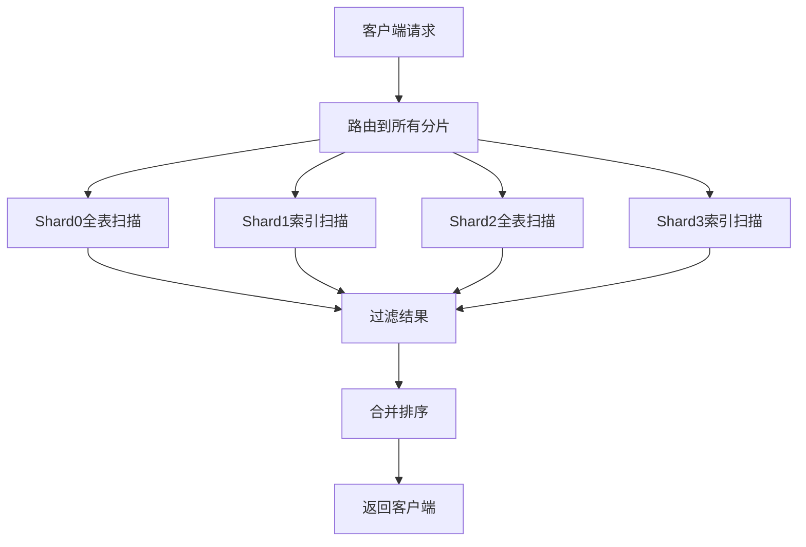

# 深入理解分片环境下时间范围查询的问题本质

您提出的困惑非常关键——只有真正理解了问题根源，才能选择最合适的解决方案。让我们从底层原理开始，逐步分析这个问题。

## 一、基础概念：什么是数据分片？

数据分片（Sharding）是一种水平拆分数据库的技术，主要目的是：
- **提高写入吞吐量**：数据分散在不同节点并行写入
- **突破单机存储限制**：数据分布在多个物理节点

**典型分片策略**：
```sql
-- 按用户ID哈希分片（最常见）
shard_id = hash(user_id) % 分片数量

-- 按时间范围分片
shard_id = 订单创建时间 / 时间间隔
```

## 二、问题产生的根本原因

### 场景还原
假设：
- 订单表按`user_id`哈希分成4个分片（Shard0-Shard3）
- 需要查询"用户A最近1小时的所有订单"

### 问题链条：
1. **数据分布特性**：
   - 用户A的订单会根据`user_id`哈希到特定分片（比如Shard1和Shard3）
   - 但这些订单的时间戳是**完全无序分散**的

2. **查询执行过程**：
   ```sql
   /* 逻辑上需要的查询 */
   SELECT * FROM orders 
   WHERE user_id = 'A' AND create_time >= NOW() - INTERVAL 1 HOUR;
   
   /* 实际执行过程 */
   -- 要在所有分片执行全表扫描
   SELECT * FROM Shard0 WHERE create_time >= ?; -- 无用户A数据
   SELECT * FROM Shard1 WHERE user_id = 'A' AND create_time >= ?; 
   SELECT * FROM Shard2 WHERE create_time >= ?; -- 无用户A数据
   SELECT * FROM Shard3 WHERE user_id = 'A' AND create_time >= ?;
   ```

3. **性能瓶颈点**：
   - **网络延迟**：与所有分片建立连接的开销（4次网络往返）
   - **磁盘IO**：每个分片都要扫描时间索引（即使某些分片没有目标数据）
   - **结果合并**：需要在内存中排序大量跨分片数据

## 三、关键问题可视化

### 数据分布示意图
```
[Shard0] 
  Order1: userB, 10:00
  Order2: userC, 10:30

[Shard1] 
  Order3: userA, 10:15 ← 我们需要这个
  Order4: userD, 10:45

[Shard2]
  Order5: userA, 09:50 ← 超出时间范围但也要扫描
  Order6: userE, 10:20

[Shard3]
  Order7: userA, 10:05 ← 我们需要这个
  Order8: userF, 10:35
```

### 查询执行流程图


## 四、为什么传统优化方法失效？

1. **索引失效**：
   - 单独的用户ID索引或时间索引都无法满足`user_id + time`的复合查询
   - 分片后**无法创建全局索引**

2. **分区表局限**：
   - 如果按时间分区，按user_id查询会扫描所有分区
   - 如果按user_id分区，按时间查询会扫描所有用户

3. **缓存难题**：
   - `userA+最近1小时`的组合键缓存命中率低
   - 每个用户的时间窗口查询都是独立缓存键

## 五、典型案例分析

### 电商平台订单查询
- **现象**：用户查看"我的最近订单"时响应缓慢
- **背后真相**：
  - 订单表按`user_id`分片到16个节点
  - 即使只查询最近1小时数据，也要访问全部16个分片
  - 其中14个分片根本没有该用户的数据

### 物联网设备数据
- **现象**：查询某设备最近状态延迟高
- **背后真相**：
  - 数据按设备ID哈希分片
  - 时间条件导致所有分片都要参与查询

## 六、解决方案设计原则

1. **减少无效分片访问**：
   - 知道数据在哪些分片，避免全分片扫描

2. **降低结果集规模**：
   - 分片层先过滤，合并层少处理

3. **利用并行处理**：
   - 用并发抵消网络延迟

4. **空间换时间**：
   - 预计算、缓存、冗余存储

## 七、理解解决方案的演进

### 第一代方案：并行查询
```java
// 伪代码：同时查询所有分片
List<Order> results = shards.parallelStream()
    .flatMap(shard -> shard.queryOrders(userId, timeRange).stream())
    .collect(Collectors.toList());
```
**缺点**：仍然访问了所有分片

### 第二代方案：路由优化
```sql
-- 元数据表记录用户所在分片
SELECT shard_id FROM user_shard_mapping WHERE user_id = 'A';

-- 只查询特定分片
SELECT * FROM Shard1 WHERE user_id = 'A' AND create_time >= ?;
SELECT * FROM Shard3 WHERE user_id = 'A' AND create_time >= ?;
```

### 第三代方案：实时物化视图
```
[订单写入] → [Kafka] → [Flink实时计算] → [用户最新订单Redis缓存]
```

### 第四代方案：混合分片策略
```
分片键 = (时间片 + 用户ID哈希) 双维度分片
```

通过这个演进过程，您可以看到解决方案是如何一步步针对核心痛点进行优化的。理解了这个脉络，就能根据实际业务场景选择合适的方案。