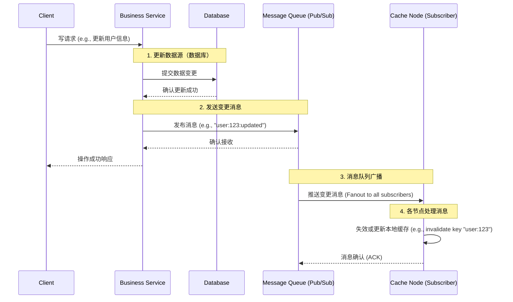

# Redis 与 Caffeine 作为二级缓存架构存在的一致性问题解决方案


基于消息队列（MQ）和发布/订阅（Pub/Sub）模式来解决**分布式缓存一致性**问题，是一个在分布式系统中非常经典和实用的方案。它主要用来解决当数据源（如数据库）的数据发生变化时，如何及时、可靠地通知到各个分布式节点上的缓存（如本地缓存 Caffeine 或分布式缓存 Redis），使其保持一致。

我会从以下几个方面为你详细解释：

1.  **为何需要消息队列和发布/订阅？**
2.  **核心架构与工作流程**
3.  **保证可靠性的关键机制**
4.  **优缺点分析**
5.  **实战方案示例**

### 1. 为何需要消息队列和发布/订阅？

在分布式系统中，尤其是使用了本地缓存（如 Caffeine）时，一旦后台数据发生变化，如何让所有服务节点的本地缓存都能得到更新或失效，是一个挑战。

*   **传统方案的不足**：单纯依靠设置短暂的缓存过期时间（TTL）会带来延迟和不必要的数据库压力。而直接通过数据库触发器或定时任务去轮询通知各个服务节点，在系统复杂、节点众多时，耦合性高，扩展性差，且容易出错。
*   **消息队列的优势**：引入消 队列作为“**中间人**”，可以很好地实现**系统解耦**和**异步通信**。数据变更服务（生产者）只需要通知MQ，而不必关心有多少个缓存服务需要更新。各个缓存服务（消费者）订阅自己关心的消息，一旦有消息到来，就执行相应的缓存更新操作。这样，任何一方的故障都不会立即影响另一方，提高了系统的整体弹性和可维护性。

### 2. 核心架构与工作流程

下面这个序列图清晰地展示了基于发布/订阅模式缓存更新的核心流程：



整个过程核心步骤如下：

1.  **数据变更与消息发布**：当某个业务服务（如用户服务）对数据库中的数据进行**增删改**操作后，它会随即向消息队列的一个特定 **Topic**（主题）或 **Exchange**（交换机）发布一条消息。这条消息通常包含变更数据的唯一标识（如用户ID `123`）和操作类型（如 `update`）。
2.  **消息路由与订阅**：消息队列负责将这条消息**广播**给所有订阅了该Topic的消费者。RabbitMQ 的 Fanout Exchange 或 Kafka 的 Topic 都能很好地支持这种一对多的发布/订阅模式。
3.  **缓存节点处理消息**：所有部署了业务服务的节点（同时也是缓存节点）都订阅了这个Topic。当它们收到消息后，会根据消息内容执行**本地缓存失效** (`invalidate`) 或**更新** (`put`) 操作。
4.  **保证送达确认**：消费者节点在处理完消息（成功使缓存失效）后，会向消息队列发送一个 **ACK**（确认应答），告知消息已被成功处理。如果消息处理失败，MQ会尝试重新投递。

通过以上流程，所有节点的本地缓存都在数据库变更后很快被清理。后续的读请求会首先在本地缓存中找不到数据，然后从数据库或分布式缓存（如Redis）中加载最新的数据，从而保证了数据的最终一致性。

### 3. 保证可靠性的关键机制

一个健壮的方案必须考虑各种异常情况。以下是确保方案可靠性的核心机制：

| 机制                                  | 描述                                                         | 解决什么问题                                                 |
| :------------------------------------ | :----------------------------------------------------------- | :----------------------------------------------------------- |
| **生产者确认** (Publisher Confirm)    | 消息队列确认已收到生产者发送的消息并持久化。                 | 防止消息在发送到MQ前就丢失。                                 |
| **消息持久化** (Message Persistence)  | 将消息本身和队列的元数据持久化到磁盘。                       | 防止MQ服务器宕机导致消息丢失。                               |
| **消费者确认** (Consumer Ack)         | 消费者在处理完消息后手动向MQ发送确认。只有收到Ack，MQ才认为消息成功消费。 | 防止消息在处理过程中（如应用收到消息但还没失效缓存就崩溃）丢失。 |
| **失败重试** (Retry with Backoff)     | 消费者处理失败时，可将消息放入**重试队列**，延迟一段时间后再次消费。 | 应对暂时的网络波动或依赖服务不可用。                         |
| **死信队列** (Dead-Letter Queue, DLQ) | 经过多次重试后仍然失败的消息会被转移到DLQ，供人工或单独程序处理。 | 防止因个别无法处理的消息堵塞主队列，便于问题排查和修复。     |

这些机制共同作用，确保了从数据变更到缓存更新这个链条的**可靠性**，即使在部分组件出现故障时，消息也不会丢失，并能在故障恢复后继续处理。

### 4. 优缺点分析

#### 优点

*   **高效解耦**：数据生产者与消费者完全解耦，双方无需知道对方的存在，系统扩展性和维护性极大提升。
*   **高性能与低延迟**：基于事件通知，缓存更新及时，延迟远低于TTL过期方式。
*   **高可靠性**：利用MQ的持久化和ACK机制，消息不易丢失，保证了最终一致性。
*   **支持大规模集群**：Pub/Sub模式天然支持广播，非常适合节点众多的分布式系统。

#### 缺点与挑战

*   **系统复杂度增加**：引入了新的中间件（MQ），需要额外维护其高可用和监控，增加了技术栈的复杂性。
*   **短暂的数据不一致窗口**：这是**最终一致性**模型的固有特点。在消息产生、传输和处理的过程中，各个节点看到的数据会有一个极短时间的不一致。
*   **消息顺序**：如果对同一条数据连续发布多条更新消息，消息到达各个消费者的顺序必须与发送顺序一致，否则会导致缓存数据最终状态错误。这就需要保证**消息的顺序性**（某些MQ如Kafka的Partition可以保证顺序）。
*   **架构师方案-本地缓存一致性刷新方案**中也提到了MQ广播消息的方式，并指出其可能存在**消息积压**和**消息顺序**的问题。

### 5. 实战方案示例

以下是一个结合 Spring Boot、Caffeine、RabbitMQ 的简易实现：

**1. 引入依赖 (Maven)**
```xml
<dependency>
    <groupId>org.springframework.boot</groupId>
    <artifactId>spring-boot-starter-cache</artifactId>
</dependency>
<dependency>
    <groupId>org.springframework.boot</groupId>
    <artifactId>spring-boot-starter-amqp</artifactId>
</dependency>
<dependency>
    <groupId>com.github.ben-manes.caffeine</groupId>
    <artifactId>caffeine</artifactId>
</dependency>
```

**2. 应用配置 (application.yml)**
```yaml
spring:
  rabbitmq:
    host: localhost
    port: 5672
    username: guest
    password: guest
    publisher-confirms: true # 开启生产者确认
    publisher-returns: true
  cache:
    type: caffeine
    caffeine:
      spec: maximumSize=500, expireAfterAccess=300s
```

**3. 定义MQ配置和消费者**
```java
@Configuration
@EnableCaching
public class CacheInvalidationConfig {

    public static final String CACHE_TOPIC_EXCHANGE = "cache.events.exchange";
    public static final String QUEUE_NAME_PREFIX = "user-service.cache-invalidation.";

    // 声明一个Topic交换机
    @Bean
    public TopicExchange cacheTopicExchange() {
        return new TopicExchange(CACHE_TOPIC_EXCHANGE);
    }

    // 为每个服务实例创建一个匿名队列（实际中可用特定队列名）
    @Bean
    public Queue cacheInvalidationQueue() {
        return new AnonymousQueue();
    }

    // 将队列绑定到交换机，监听 "user.*" 的路由键
    @Bean
    public Binding binding(Queue cacheInvalidationQueue, TopicExchange cacheTopicExchange) {
        return BindingBuilder.bind(cacheInvalidationQueue).to(cacheTopicExchange).with("user.*");
    }

    // 消息监听容器
    @Bean
    public SimpleMessageListenerContainer listenerContainer(ConnectionFactory connectionFactory, MessageListenerAdapter listenerAdapter, Queue cacheInvalidationQueue) {
        SimpleMessageListenerContainer container = new SimpleMessageListenerContainer();
        container.setConnectionFactory(connectionFactory);
        container.setQueues(cacheInvalidationQueue);
        container.setMessageListener(listenerAdapter);
        container.setAcknowledgeMode(AcknowledgeMode.MANUAL); // 开启手动ACK
        return container;
    }
}
```

**4. 消息监听与缓存处理**
```java
@Component
public class CacheInvalidationListener {

    @Autowired
    private CacheManager cacheManager;

    @RabbitListener(queues = "#{@cacheInvalidationQueue.name}")
    public void handleCacheInvalidationMessage(CacheEvictionMessage message, Channel channel, @Header(AmqpHeaders.DELIVERY_TAG) long tag) throws IOException {
        String cacheName = message.getCacheName();
        Object key = message.getKey();

        try {
            // 1. 处理消息：失效指定缓存
            Cache cache = cacheManager.getCache(cacheName);
            if (cache != null) {
                cache.evict(key); // 执行缓存失效
            }

            // 2. 手动ACK，告知MQ消息已成功处理
            channel.basicAck(tag, false);
        } catch (Exception e) {
            // 3. 处理失败，拒绝消息并重新放入队列（或转入DLQ）
            channel.basicNack(tag, false, true);
        }
    }
}
```

**5. 数据变更处发布消息**
```java
@Service
public class UserService {

    @Autowired
    private AmqpTemplate amqpTemplate;
    @Autowired
    private UserRepository userRepository;

    @Transactional
    public User updateUser(User user) {
        // 1. 更新数据库
        User updatedUser = userRepository.save(user);

        // 2. 构造并发送缓存失效消息
        CacheEvictionMessage message = new CacheEvictionMessage("users", user.getId());
        amqpTemplate.convertAndSend(CacheInvalidationConfig.CACHE_TOPIC_EXCHANGE, "user.updated", message);

        return updatedUser;
    }
}
```

### 总结

利用消息队列的发布/订阅模式来解决分布式缓存一致性，是一个非常有效的方案，其核心思想是**通过事件驱动来实现最终一致性**。

它通过**解耦**和**异步化**带来了巨大的**可扩展性**和**可靠性**优势，非常适合中大型分布式系统。当然，它也引入了额外的复杂度，并需要仔细处理消息顺序、幂等性等问题。在选择时，需要根据你自身业务对一致性的要求、团队技术栈和运维能力进行综合权衡。