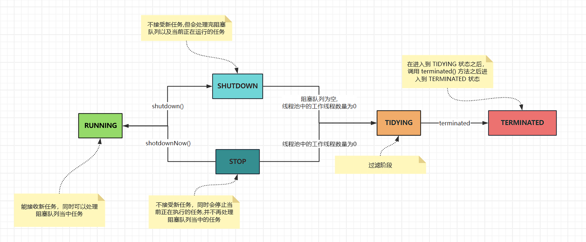
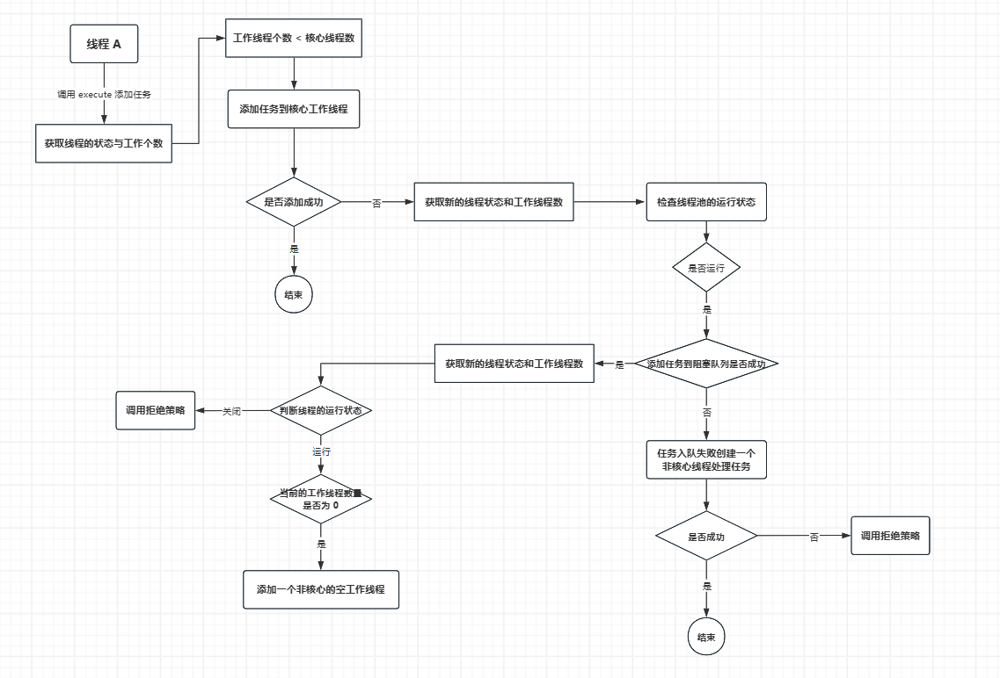

## 并发编程完整版本之线程池

### 前言

在实际的一些业务开发当中，对于一些较大的的任务，可能会使用到多线程并发异步拆分，汇总去处理一些业务上的问题，比如，对于一个业务可能会同时设计到 SQL 的查询，数据的计算，文件的 I/O，以及远程服务的调度等，这些业务可能是没有强联系的，就可以通过线程异步并发执行，来提高执行的效率缩短客户端的响应时间。

但如果对于这些业务，在开发当中频繁的业务的线程对象进行创建&销毁，这个过程当中需要频繁的进行栈内存的分配，这样会对**系统产生额外的开销**，以及在业务的处理过程当中，到底线程处理了多少个任务以及每一个线程所占用的**系统资源开销是无法进行统计和管理的**， 也同时可能由于编码人员的专业能力可能会编码出隐藏的 bug 导致**线程个数爆**炸这样的风险。

因此，为了解决上述出现的一系列让人头疼的问题，让开放者更加专注于业务的整体逻辑，而并非是对线程的管理，就急需要一种可以做到 **统一管理集中管理监控线程的工具** ，也就是*<u>**线程池**</u>* 。线程池可以让开发者从让开发者不再花费更多的精力去管理线程的创建&销毁以及线程使用不当，导致线程数量爆炸等极端情况，更高的关注于业务层面。

### JDK 当中自带线程工厂方法

并发大师 Doug Lea 在 JDK 1.5 当中针对于不同的需要引入了不同的线程池对象，接下来将一一介绍这些这些 JDK 自带的线程池工具。

#### **newFixedThreadPool 创建固定大小的线程池** 

~~~ java
public void fixedThreadPoolMax(Boolean isShutDown) {
    ExecutorService executorService = Executors.newFixedThreadPool(200);
    for (int i = 0; i < 200; i++) {
        executorService.execute(ThreadPoolExecutorExample::printf);
    }
    //这里如果不执行 shutdown 就不会被回收
    if (isShutDown) executorService.shutdown();
}
~~~

~~~ java
public static ExecutorService newFixedThreadPool(int nThreads) {
    return new ThreadPoolExecutor(nThreads, nThreads,
                                  0L, TimeUnit.MILLISECONDS,
                                  new LinkedBlockingQueue<Runnable>());
}
~~~

~~~ java
public ThreadPoolExecutor(int corePoolSize,
                          int maximumPoolSize,
                          long keepAliveTime,
                          TimeUnit unit,
                          BlockingQueue<Runnable> workQueue) {
    this(corePoolSize, maximumPoolSize, keepAliveTime, unit, workQueue,
         Executors.defaultThreadFactory(), defaultHandler);
}
~~~

通过底层源码可以看出，在调用 `newFixedThreadPool ` 之后会返回一个 `ThreadPoolExecutor` 对象，其主要返回的了一个 `ThreadPoolExecutor` 线程池对象，如果不通过 `newFixedThreadPool` 方法调用，而是直接通过`ThreadPoolExecutor` 创建对象，其效果也是一样的，可以理解为 `newFixedThreadPool` 是对 `ThreadPoolExecutor` 对象创建的一种封装。

可以看到的底层是使用了 ` LinkedBlockingQueue<Runnable>()` 链表队列来存储 `Runnable ` 线程任务的,这里需要注意的是这些给定的线程池大小，线程在一开始并不会被全部初始化创建好，而是在执行 `execute` 方法的时候会懒加载创建 `Thread` 对象，并且在使用完线程池资源之后需要执行 `shutdown` 关闭线程池。

#### **newSingleThreadExecutor 创建一个单例的线程池**

~~~ java
public void singleThreadExecutor() {
    ExecutorService executorService = Executors.newSingleThreadExecutor();
    executorService.execute(ThreadPoolExecutorExample::printf1);
    executorService.execute(ThreadPoolExecutorExample::printf2);
    executorService.execute(ThreadPoolExecutorExample::printf3);
}
~~~

~~~ java
public static ExecutorService newSingleThreadExecutor() {
    return new FinalizableDelegatedExecutorService
        (new ThreadPoolExecutor(1, 1,
                                0L, TimeUnit.MILLISECONDS,
                                new LinkedBlockingQueue<Runnable>()));
}
~~~

~~~ java
static class FinalizableDelegatedExecutorService
    extends DelegatedExecutorService {
    FinalizableDelegatedExecutorService(ExecutorService executor) {
        super(executor);
    }
    // finalize 当前对象被 GC 回收之前，执行的方法。因此不需要自己主动调用 shutdown 关闭线程池
    protected void finalize() {
        super.shutdown(); 
        // finalize 在执行时，是守护线程，守护线程无法保证一定可以执行完毕，因此在使用的时候如果一个线程池是基于业务构建的，在使用完毕之后一定要手动的执行 shoutdow 关闭线程池
    }
}
~~~

`newSingleThreadExecutor `从名字就可以看到返回的是一个单线程线程池，从源码可以看到在创建线程池对象的时候初始化就给的了最大线程数与核心线程数都为 1 ，这种线程对象一般是使用在 **日志顺序处理** 、**消息顺序消费** 等，可以看到始终都是只有一个线程对象，所以当任务投递过来之后第一个任务会被工作线程处理，后续的任务会被放入到工作队列当中，任务的执行会按照顺序执行。

#### **newCachedThreadPool 非核心线程空闲存活时间 **

~~~ java
public static ExecutorService newCachedThreadPool() {
    return new ThreadPoolExecutor(0, Integer.MAX_VALUE,
                                  60L, TimeUnit.SECONDS,
                                  new SynchronousQueue<Runnable>());
}
~~~

~~~ java
//等待工作的空闲线程的超时（以纳秒为单位）。当存在超过 corePoolSize 或 allowCoreThreadTimeOut 时，线程将使用此超时。否则，他们将永远等待新的工作。   
private volatile long keepAliveTime;
~~~

从构造方法可以看到，最大的线程数是 `Integer.MAX_VALUE` ，所以只要提交任务就会立即被执行而不会被阻塞，任务队列是一个 `SynchronousQueue` 因此也决定了其底层的特性是，不存储阻塞任何的任务，同时有多少个任务就有多少个线程池对象。当前线程数大于等于核心线程数时，当线程的空闲时间超过指定的 `keepAliveTime`  ,该线程就会被终止，直到当前线程数 = `corePoolSize`

- 特殊配置

~~~ java
// 允许回收核心线程
executor.allowCoreThreadTimeOut(true);
// 此时corePoolSize的线程空闲超过keepAliveTime也会被回收
~~~

一般来说，这种线程池可以用于对于短时间内突然激增的高并发的场景，比如 **电商的限时秒杀场景** ，在突发流量一定时间之后，这些线程就会被回收。

#### **newScheduledThreadPool 定时任务线程池**

~~~ java
public static ScheduledExecutorService newScheduledThreadPool(int corePoolSize) {
    return new ScheduledThreadPoolExecutor(corePoolSize);
}
~~~

~~~ java
public ScheduledThreadPoolExecutor(int corePoolSize) {
    super(corePoolSize, Integer.MAX_VALUE, 0, NANOSECONDS,
          //基于延时队列实现的线程池,周期性是在执行完成之后再次丢回到阻塞队列当中
          new DelayedWorkQueue());
}
~~~

~~~ java
public ThreadPoolExecutor(int corePoolSize,
                          int maximumPoolSize,
                          long keepAliveTime,
                          TimeUnit unit,
                          BlockingQueue<Runnable> workQueue) {
    this(corePoolSize, maximumPoolSize, keepAliveTime, unit, workQueue,
         Executors.defaultThreadFactory(), defaultHandler);
}
~~~

- 调用定时方法

~~~ java
public void scheduledThread() {
        ScheduledExecutorService scheduledThreadPool = Executors.newScheduledThreadPool(5);
        System.out.println("开始执行的时间:--> " + new Date());
        scheduledThreadPool.schedule(() -> {
            ThreadPoolExecutorExample.delayTask(1, 1);
        }, 1, TimeUnit.SECONDS);

        scheduledThreadPool.schedule(() -> {
            ThreadPoolExecutorExample.delayTask(2, 5);
        }, 5, TimeUnit.SECONDS);

        scheduledThreadPool.schedule(() -> {
            ThreadPoolExecutorExample.delayTask(3, 10);
        }, 10, TimeUnit.SECONDS);
        System.out.println("执行结束的时间:--> " + new Date());

        scheduledThreadPool.scheduleAtFixedRate(() -> {
            ThreadPoolExecutorExample.delayTask(4, 3);
        }, 3, 5, TimeUnit.SECONDS);
        System.out.println("执行结束的时间:--> " + new Date());
    }
~~~

`newScheduledThreadPool ` 是一个定时任务的线程池，同样给定的最大线程数与前面的 `newCachedThreadPool` 空闲线程回收的线程池是一样的，都是 `Interage.MAX_VALUE` ,区别在于 `ScheduledThreadPoolExecutor` 基础了 `ThreadPoolExecutor` 类，对原有的线程池对象的功能进行了扩展。

~~~ java
public ScheduledFuture<?> schedule(Runnable command,
                                   long delay, TimeUnit unit);
~~~

这里的 `delay` 延时参数，是指定从现在开始执行的延时时间，也就是说这个计时是从任务提交的时候就已经开始计时了，假设延时10秒，一个任务执行时间是 3 s ，而提交之后阻塞了5秒，那这个任务实际是被延时了 5 秒执行。

同时还提供了一个定期延时执行的函数方法 `scheduleAtFixedRate` 其中多了一个 `period` 执行时间间隔的参数。

~~~ java
public ScheduledFuture<?> scheduleAtFixedRate(Runnable command,
                                                  long initialDelay,
                                                  long period,
                                                  TimeUnit unit);
~~~

#### **newWorkStealingPool工作窃取的线程池**

在说明 `newWorkStealingPool` 之前，可能需要先了解一下 **工作窃取** 这种算法的底层思想，工作窃取简单来说，其实就是 **当前自己的工作做完之后，就去看看别人的工资是否做完，如果有就将被人工作拿过来帮他处理完**

底层的核心算法思想是，***为每一个工作者分配了一个双端队列用于存储需要执行的任务，当前自己本地无工作任务的失败，就会去窃取其他的工作线程尚未处理完成的任务***

`newWorkStealingPool` 处理了使用前面提到的 **工作窃取** 这种思想，在这个基础之上使用分而治之进行任务拆分。

~~~ java
public void workStealingThread() {
    Integer[] maxArray = new Integer[100_000_000];
    System.out.println("开始时间:--> " + new Date());
    for (int i = 0; i < maxArray.length; i++) {
        maxArray[i] = i * 1000;
    }
    System.out.println("结束时间:--> " + new Date());

    ForkJoinPool forkJoinPool = new ForkJoinPool(); // 工作窃取池的底层实现
    System.out.println("============================================================================");
    System.out.println("开始时间:--> " + new Date());
    long result = forkJoinPool.invoke(new SumTask(maxArray, 0, maxArray.length));
    System.out.println("结束时间:--> " + new Date());
}
~~~

~~~ java
class SumTask extends RecursiveTask<Long> {
    private final Integer[] array;
    private final int start;
    private final int end;
    private static final int THRESHOLD = 10_000; // 阈值

    SumTask(Integer[] array, int start, int end) {
        this.array = array;
        this.start = start;
        this.end = end;
    }

    @Override
    protected Long compute() {
        if (end - start <= THRESHOLD) {
            long sum = 0;
            for (int i = start; i < end; i++) {
                sum += (long) array[i] * array[i];
            }
            return sum;
        } else {
            int mid = (start + end) / 2;
            SumTask left = new SumTask(array, start, mid);
            SumTask right = new SumTask(array, mid, end);
            left.fork(); // 异步执行左半部分
            return right.compute() + left.join(); // 合并结果
        }
    }
}
~~~

### ThreadPoolExecutor 应用与源码分析

虽然说 JDK 内部提供了很多线程工厂方法，屏蔽了很多创建的细节，线程池对象提供了7个核心参数，每一个线程池都有其核心的参数，如果直接使用 JDK 自带的线程工厂方法创建对象，可以设置核心参数太少，这样会导致我们对于线程池的控制粒度过粗，所以在阿里规范当中也是推荐自己去自定义线程，创建 ThreadPoolExcutor

#### **ThreadPoolExcutor的四种拒绝策略**

~~~ java
public ThreadPoolExecutor(int corePoolSize, //核心线程数（当前任务执行结束之后不会被销毁）
                              int maximumPoolSize, //最大线程数 （代表当前线程池中，一共可以有多少个工作线程）
                              long keepAliveTime, //非核心工作线程在阻塞队列当中等待的时间
                              TimeUnit unit, //非核心工作线程在阻塞队列等待的时间单位
                              BlockingQueue<Runnable> workQueue, // 任务在没有核心工作线程处理时，任务先扔到阻塞队列当中
                              ThreadFactory threadFactory, //线程构建的工厂,可以设置一些线程的基本信息,比如线程名
                              RejectedExecutionHandler handler //拒绝策列)
~~~

~~~ java
public static class CallerRunsPolicy implements RejectedExecutionHandler {
    public CallerRunsPolicy() { }
    public void rejectedExecution(Runnable r, ThreadPoolExecutor e) {
        if (!e.isShutdown()) {
            //在线程池无法处理任务的时候，将任务交给调用者处理
            r.run();
        }
    }
}
~~~

~~~ java
public static class AbortPolicy implements RejectedExecutionHandler {
    public AbortPolicy() { }
//当任务无法处理的时候,直接抛出一个调度异常
    public void rejectedExecution(Runnable r, ThreadPoolExecutor e) {
        throw new RejectedExecutionException("Task " + r.toString() +  " rejected from " + e.toString());
    }
}
~~~

~~~ java
public static class DiscardPolicy implements RejectedExecutionHandler {
    public DiscardPolicy() { }
    //任务无法处理的时候,直接放弃任务的执行也就是丢弃任务,什么都不做
    public void rejectedExecution(Runnable r, ThreadPoolExecutor e) {
    }
}
~~~

~~~ java
public static class DiscardOldestPolicy implements RejectedExecutionHandler {
    public DiscardOldestPolicy() { }
    public void rejectedExecution(Runnable r, ThreadPoolExecutor e) {
        //判断当前的线程池是否关闭
        if (!e.isShutdown()) {
            //直接将任务队列当中最早的任务丢弃,再次尝试将任务交给线程池处理
            e.getQueue().poll();
            e.execute(r);
        }
    }
}
~~~

当前对于处理以上四种，JDK 提供的拒绝策略以外，我们可以直接通过继承 `RejectedExecutionHandler` 接口通自定义实现 `rejectedExecution` 方法来实现自定义的拒绝策略的。

以下的代码是一个自定义创建线程池对象的案例

~~~ java
// 创建一个自定义的线程池对象
public class MyThreadPoolExecutor {
private static volatile ThreadPoolExecutor executor;

public static ThreadPoolExecutor create() {
    if (executor == null) {
        synchronized (MyThreadPoolExecutor.class) {
            final int corePoolSize = Runtime.getRuntime().availableProcessors(); //当前 Java 虚拟机可用的处理器数
            final int maximumPoolSize = corePoolSize * 2; //最大线程数
            final int keepAliveTime = 60; //阻塞队列等待的时间
            final TimeUnit unit = TimeUnit.SECONDS; //等待的时间单位
            final BlockingQueue<Runnable> workQueue = new LinkedBlockingQueue<Runnable>(maximumPoolSize); //阻塞的队列
            final RejectedExecutionHandler handler = new MyThreadPoolExecutor.MyRejected();
            final ThreadFactory threadFactory = new ThreadFactory() {
                private final AtomicInteger threadNumber = new AtomicInteger(1);

                public Thread newThread(Runnable r) {
                    return new Thread(r, "MyThreadPoolExecutor-" + threadNumber.getAndIncrement());
                }
            };
            if (executor == null) {
                executor = new ThreadPoolExecutor(
                        corePoolSize, maximumPoolSize, keepAliveTime, unit, workQueue, threadFactory, handler
                );
            }
        }
    }
    return executor;
}

static class MyRejected implements RejectedExecutionHandler {

    @Override
    public void rejectedExecution(Runnable r, ThreadPoolExecutor executor) {
        System.out.println("执行了自定义的拒绝策略");
        executor.getQueue().poll();
        executor.execute(r);
    }
}
}
~~~

~~~ java
public void testCreateThreadPool() throws ExecutionException, InterruptedException {
    ThreadPoolExecutor pool = MyThreadPoolExecutor.create();
    Future<String> submit = pool.submit(() -> {
        //执行有返回结果的任务
        return "返回的结果....";
    });
    String result = submit.get(); //获取执行的返回结果
    pool.execute(() -> {
        //执行没有返回结果任务
    });
    pool.shutdown(); //关闭线程池
}
~~~

#### ThreadPoolExecutor 底层源码分析

**核心属性参数**

~~~ java
// ctl 声明成一个 AtomicInteger 对象保证在进行 ++ /-- 的时候以原子性操作
// 同时生命成一个 int 类型的值，用高 3 位表示线程的状态,低29位表示工作线程的个数，Doug Lea 这样做的目的一方面是尽可能的节约内存,另一方面主要是为了声明两个变量可能会导致在修改的时候命中不同的 CPU 缓存行，降低执行的效率。
private final AtomicInteger ctl = new AtomicInteger(ctlOf(RUNNING, 0));

// 获取 Interage bit 位置的个数, 32 - 3 = 29 低 29 位
private static final int COUNT_BITS = Integer.SIZE - 3;
// 表示工作线程的低 29 位工作线程的 个数
private static final int CAPACITY   = (1 << COUNT_BITS) - 1;

// 线程池的 状态
// RUNNING = -1 << 29 = -536,870,912 该状态表示当前的线程池是没有任何问题,可以正常接收任务，除此之外的其他状态不可以接收任务
private static final int RUNNING    = -1 << COUNT_BITS; 

// SHUTDOWN = 0 << 29 = 0   不会接收新任务,正在处理的任务正常进行,阻塞队列的任务也会处理完，但不接收新任务
private static final int SHUTDOWN   =  0 << COUNT_BITS;
// STOP = 1 << 29 = 536,870,912   不接收新任务,正在处理任务的线程会被中断,阻塞队列的任务全部不处理
private static final int STOP       =  1 << COUNT_BITS;
// TIDYING = 2 << 29 = 1,073,741,824   这个状态是从 SHUTDOWN 或 STOP  状态过渡而来,只是一个过渡状态
private static final int TIDYING    =  2 << COUNT_BITS;
// TERMINATED = 3 << 29 = 1,610,612,736  该状态是从 TIDYING 状态转换过来, 转换过来只需要执行一个 terminated 方法
private static final int TERMINATED =  3 << COUNT_BITS;

// 与运算，拿到高3位的值
private static int runStateOf(int c)     { return c & ~CAPACITY; }
// 与运算, 拿到低29位置的值
private static int workerCountOf(int c)  { return c & CAPACITY; }
~~~

 

**有参构造**

~~~ java
public ThreadPoolExecutor(int corePoolSize,
                          int maximumPoolSize,
                          long keepAliveTime,
                          TimeUnit unit,
                          BlockingQueue<Runnable> workQueue,
                          ThreadFactory threadFactory,
                          RejectedExecutionHandler handler) {
   //健壮性的一些基本校验
    if (corePoolSize < 0 || //核心线程数
        maximumPoolSize <= 0 || //最大线程数
        maximumPoolSize < corePoolSize || //最大线程数必须大于核心线程数
        keepAliveTime < 0) //阻塞超时时间
        throw new IllegalArgumentException();
    //阻塞队列、线程工厂、拒绝策略 不可为空
    if (workQueue == null || threadFactory == null || handler == null)
        throw new NullPointerException();
    //这是一个系统方法资源的策略,这个与线程池关系并不大
    this.acc = System.getSecurityManager() == null ?
            null :
            AccessController.getContext();
    //有参构造赋值
    this.corePoolSize = corePoolSize;
    this.maximumPoolSize = maximumPoolSize;
    this.workQueue = workQueue;
    //将阻塞超时时间转为 纳秒
    this.keepAliveTime = unit.toNanos(keepAliveTime);
    this.threadFactory = threadFactory;
    this.handler = handler;
}
~~~

##### **执行任务的 execute 方法**

线程池提交任务有两个方法一个携带返回值的 `submit()` ，另一个是无返回值的 `execute()` 方法，其实 `submit()` 方法的底层调用的就是 `execute()` 方法。因此这里研究 `submit()` 方法即可。

~~~ java
// submit 提交任务
public <T> Future<T> submit(Callable<T> task) {
    if (task == null) throw new NullPointerException();
    RunnableFuture<T> ftask = newTaskFor(task);
    execute(ftask);
    return ftask;
}
~~~

~~~ java
// execute 提交任务
public void execute(Runnable command) {
    if (command == null)
        throw new NullPointerException();
    //获取线程的状态与工作线程个数
    int c = ctl.get();
    //判断工作线程个数是否小于核心线程数
    if (workerCountOf(c) < corePoolSize) {
        //如何创建核心任务成功直接返回
        if (addWorker(command, true))
            return;
            //如果失败,重新获取新 ctl 值
        c = ctl.get();
    }

    //检查线程池是否处于 运行状态 ,尝试将任务放入到阻塞队列
    if (isRunning(c) && workQueue.offer(command)) {
        //入队成功,双重检查线程池状态
        int recheck = ctl.get();
        //如果线程池关闭,移除任务
        if (!isRunning(recheck) && remove(command)
            //如果移除调用拒绝策略
            reject(command);
            //如果工作线程数量为 0 
        else if (workerCountOf(recheck) == 0)
            //创建一个新的非核心线程处理任务【首次创建】
            addWorker(null, false);
    }
    //任务入队失败,尝试创建一个新的非核心线程处理任务
    else if (!addWorker(command, false))
    //创建失败调用拒绝策略
        reject(command);
}
~~~

  

- 为什么要双重校验检查两次 isRunning 线程的运行状态？

  第一次检查 **`isRunning(c)`** 线程的运行状态是 RUNNING ,调用 **`workQueue.offer(command)`**将任务添加到阻塞队列当中，但是在这两步执行之间，其他的线程可能会调用**`shutdown()` 或 `shutdownNow()`**，导致线程池状态突然变为 `SHUTDOWN` 或 `STOP` 状态。

  如果不执行双重校验，则可能会出现，线程 A 检查 **`isRunning(c)`** 为 true ，任务入队。**此时线程 B 调用 `shutdown()`**，线程池状态变为 `SHUTDOWN`，线程池不再处理新任务，但队列中的任务会**被遗留**，任务可能永远不会被处理，后续如果没有活跃的新活跃该任务可能会一直被卡死。

- workerCountOf(recheck) == 0 创建空任务的非核心工作线程

  当前工作队列为 0 的时候会 执行`addWorker(null, false);` 方法创建一个空任务的非核心工作线程，用于处理当前队列当中任务。

  1. 在创建线程池对象的时候，设置的核心线程数为 `corePoolSize = 0`，`maximumPoolSize > 0` 此时添加的任务的时候不会创建核心线程数，而是直接进入到了阻塞队列当中，此时工作线程为 `workerCount=0`，就需要创建非核心线程，从队列当中拉取任务进行处理。
  2. 线程异常退出，线程池的配置是  `corePoolSize > 0`,但是工作线程执行任务当中出现异常抛出时候，并没有进行异常的捕获。如果所有的任务都成通过异常退出，此时 `workerCount=0`，但是队列当中仍有任务未被处理。
  3. 线程池刚启动，核心线程尚未被创建，虽然 `corePoolSize > 0`，但是首次提交任务的时候，核心线程还没有被创建 `workerCount=0`，任务直接入队，如果没有 `addWorker(null, false)`，队列任务可能无人处理

##### 添加任务 addWorker 方法

~~~ java
private boolean addWorker(Runnable firstTask, boolean core) {
//一个返回循环跳出的标记位
    retry: 
    for (;;) {
        //获取线程的执行状态
        int c = ctl.get();
        // 获取到高三位值
        int rs = runStateOf(c);
        //当线程状态不是运行中
        if (rs >= SHUTDOWN &&
        //如果当前的下面的三个条件当中有一不满足的,就不需要添加任务
        //当前线程是 SHUTDOWN
            ! (rs == SHUTDOWN &&
            //阻塞队列存在任务
                firstTask == null &&
                ! workQueue.isEmpty()))
            return false;

        for (;;) {
            //获取工作线程数
            int wc = workerCountOf(c);
            // 工作线程个数大于最大值
            if (wc >= CAPACITY ||
            //是否是核心线程, 如果是则基于核心线程个数处理，否则基于最大线程个数处理
                wc >= (core ? corePoolSize : maximumPoolSize))
                return false;
                //通过 CAS 将当前的工作线程个数 + 1
            if (compareAndIncrementWorkerCount(c))
            //CAS 成功直接跳出到外层循环
                break retry;
                //如果添加失败重新获取一个新的 ctl 值 [有可能在进行 +1 的时候，其他线程调用了 SHUTDOWN]
            c = ctl.get();  // Re-read ctl
            //如果状态不一样，说明可能执行了 SHUTDOWN 导致的需要重新再次走一遍外层循环
            if (runStateOf(c) != rs)
            //==========================添加之前校验完成,跳出到外层循环开始添加启动工作线程===================================
                continue retry;
        }
    }

    boolean workerStarted = false; //工作线程是否启动
    boolean workerAdded = false; //工作线程是否被添加
    Worker w = null; //工作线程
    try {
        w = new Worker(firstTask); //构建工作线程
        final Thread t = w.thread; //获取工作线程
        if (t != null) {  //盘点工作线程是否NULL
            final ReentrantLock mainLock = this.mainLock;
            mainLock.lock(); //添加锁保证 workers 与 largestPoolSize 的成员变量的线程安全
            try {

                int rs = runStateOf(ctl.get()); //获取线程的工作状态
                    //如果当前线程池正在运行中或者是 SHUTDOWN 状态并且提交的任务未 NULL
                if (rs < SHUTDOWN || 
                    (rs == SHUTDOWN && firstTask == null)) {
                        //当前线程的线程处于活跃状态,则抛出异常 -- 表示线程还没有被添加就已经启动，可能是线程工厂构建存在问题.
                    if (t.isAlive()) 
                        throw new IllegalThreadStateException();
                        //添加到工作队列
                    workers.add(w);
                    //获取工作线程的个数
                    int s = workers.size();
                    //如果工作队列的大于最大线程池个数
                    if (s > largestPoolSize)
                    //更新当前最大线程池
                        largestPoolSize = s;
                        //任务添加成功
                    workerAdded = true;
                }
            } finally {
                //锁资源释放
                mainLock.unlock();
            }
            //判断是否添加成功
            if (workerAdded) {
                //成功则启动添加的工作线程
                t.start();
                //工作线程启动
                workerStarted = true;
            }
        }
    } finally {
        if (! workerStarted) //是否启动
        //如果没有启动添加任务到失败的工作队列
            addWorkerFailed(w);
    }
    //返回启动状态
    return workerStarted;
}
~~~

~~~ java
private void addWorkerFailed(Worker w) {
    final ReentrantLock mainLock = this.mainLock;
    // 对 workers 操作需要加锁
    mainLock.lock();
    try {
        // worker 已经被创建
        if (w != null)
            //从工作队列当中移除失败的线程
            workers.remove(w);
        //对当前的工作线程数量 -1 
        decrementWorkerCount();
        //因为添加失败判断修改工作线程的状态  如果出现 （SHUTDOWN 和池和队列为空） 或 （STOP 和池为空） ，则转换为 TERMINATED 状态
        tryTerminate();
    } finally {
        mainLock.unlock();
    }
}
~~~

